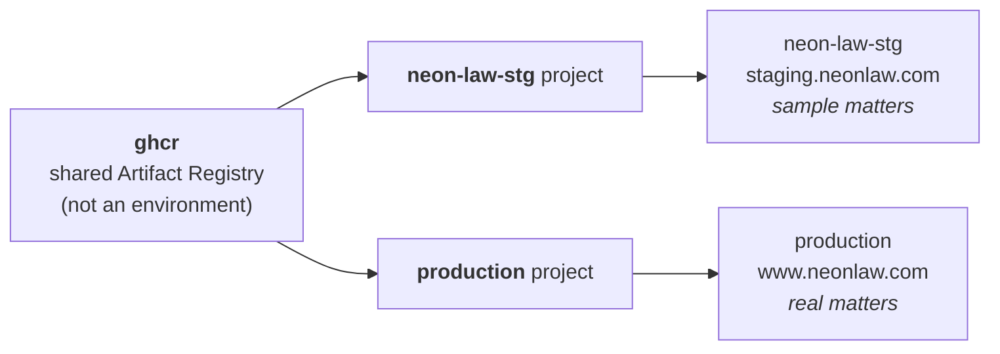

# Environments

Navigator uses one image hub, two runtime Google Cloud projects, and the deployments in the `deployments/` tree — two
live today: `neon-law-stg` and the production deployment. A deployment—not a project—is the isolation unit: it owns one
store database, four GCS buckets, one GKE Autopilot cluster, one Kubernetes namespace, one runtime Google service
account, one delegated Workspace service-account credential, one `deployments/<name>/` config, one Google Workspace
Drive root, one Restate environment, and one public hostname. A deployment exists because its directory exists.

**That tree is not in this repository.** It lives in a private repository with the credential that rolls the cluster,
because this one is public and takes pull requests from anyone. So nothing here can enumerate the rows, and nothing here
names that repository either: `deploy.yml`'s Slack report points at a checkout, taking the name from the `DEPLOY_REPO`
Actions variable when one is set, and every command below takes `--deployments-dir` to say which checkout holds the
tree. See [`deployment-secrets`](deployment-secrets.md).

`neon-law-stg` is the one persistent staging deployment, and **it is the only deployment that holds sample matters.**
Every case, client, document, and workshop roster in it is synthetic; no real person's matter is ever seeded there, and
production never carries sample data in the other direction. That boundary is what makes staging safe to reset, demo,
and screenshot.

Its deployment identity is staging, but its runtime profile is `production`: it runs `neon-server` over that sample data
plane and exercises the same root-mounted `portal` application, database access, authorization, APIs, and agent
protocols the brand binary composes. Staging and production stay separate deployments because one holds synthetic
matters and the other holds real ones; their public route tables are covered before release by the brand router and
browser suites.

## Canonical deployment matrix

Every value in the resource columns is also the corresponding `config.toml` coordinate. `NAVIGATOR_GCP_LOCATION` is
intentionally omitted from the table because it is chosen per installation; use the same region for a row's SQL
instance, buckets, and cluster.

| Deployment | GCP project | Public host | Matters | Image | Resource prefix |
| --- | --- | --- | --- | --- | --- |
| `neon-law-stg` | `neon-law-stg` | `staging.neonlaw.com` | sample | `neon-server` | `neon-law-stg` |
| the production deployment | its own project | `www.neonlaw.com` | real | `neon-server` | its deployment name |

Each row also serves a workflows host beside its public one: `workflows-staging.neonlaw.com` for `neon-law-stg` and
`workflows.neonlaw.com` for production. Both are set per deployment as `NAVIGATOR_PUBLIC_HOST` and
`NAVIGATOR_WORKFLOWS_HOST`.

**One production.** One deployment serves real matters, and `www.neonlaw.com` is the only public host that reaches them.
Staging carries a public name so a link to it resolves, not so it is open: its perimeter is the tailnet allowlist, which
is what "private mode" configures.

Production is a rollable deployment. Its `deployments/<name>/` directory in the deploy repository carries both
`config.toml` and `secrets.enc.yaml`, and nothing in this repository's CI rolls it. A person runs the `ops ship` command
`deploy.yml` posts to `#navigator`, from a checkout of that repository. See
[`gitops.md`](gitops.md#the-deploy-is-a-human-act).

Its substrate is provisioned in its own project under its own prefix: the Autopilot cluster, the `<prefix>-pg` Cloud SQL
instance, and the `<prefix>-gateway-ip` global address. That address is a deployment coordinate, not a fact about
Navigator: it lives in the deployment's `config.toml` as `NAVIGATOR_GATEWAY_IP`, and `gcloud compute addresses describe
<prefix>-gateway-ip --global --format='value(address)'` prints the current value.

The host cutover has happened. `www.neonlaw.com` and `workflows.neonlaw.com` both resolve to that address and are served
by this deployment's Ingress, with both `ManagedCertificate` resources Active. See
[`marketing-sites`](marketing-sites.md).

Each deployment serves its own host, and the host says what the deployment is. `www.neonlaw.com` is production: the
firm at the root, over real matters. Staging serves `staging.neonlaw.com` over sample
data, so a visitor never has to guess which one they reached. `neon` is the identifier that names the GCP projects
`neon-law-stg` and production and the image `neon-server`; the public brand lives only in the domain. Each row's
Workspace is in the Drive table under [Matter storage](#matter-storage-and-workspace-attachment).

For a resource prefix `<name>`, set:

| Variable | Value |
| --- | --- |
| `NAVIGATOR_GKE_CLUSTER_NAME` | `<name>` |
| `NAVIGATOR_GKE_CONTEXT` | `gke_<project>_<region>_<name>` |
| `NAVIGATOR_K8S_NAMESPACE` | `<name>` |
| `NAVIGATOR_VPC_NAME` | `<name>-vpc` |
| `NAVIGATOR_SUBNETWORK_NAME` | `<name>-subnet` |
| `NAVIGATOR_GATEWAY_IP_NAME` | `<name>-gateway-ip` |
| `NAVIGATOR_ASSETS_BUCKET` | `<name>-assets` |
| `NAVIGATOR_DOCUMENTS_BUCKET` | `<name>-documents` |
| `NAVIGATOR_EXPORTS_BUCKET` | `<name>-exports` |
| `NAVIGATOR_LOGS_BUCKET` | `<name>-logs` |
| `NAVIGATOR_GCP_SERVICE_ACCOUNT_ID` | `<name>-web` |
| `NAVIGATOR_DRIVE_GCP_SERVICE_ACCOUNT_ID` | `<name>-drive` |
| `NAVIGATOR_WEB_SECRET_NAME` | `<name>-web-secrets` |

Bucket names are globally scoped in GCS. If one of these short names is already taken, add a stable organization prefix
to all four bucket names; do not change the deployment prefix used for other resources.

`NAVIGATOR_PUBLIC_HOST` is the exact public host in the matrix, and `NAVIGATOR_WORKFLOWS_HOST` is the workflows host
beside it: `workflows.neonlaw.com` for production, `workflows-staging.neonlaw.com` for `neon-law-stg`. Both rows sit on
`neonlaw.com`, and staging's names are a subdomain and a hyphenated sibling rather than a separate domain, so a
deployment never borrows another row's host. Set `NAV_BASE_URL` to `https://$NAVIGATOR_PUBLIC_HOST`,
`NAVIGATOR_WORKFLOWS_URL` to `https://$NAVIGATOR_WORKFLOWS_HOST/`, and `NAVIGATOR_ASSET_BASE_URL` to
`$NAV_BASE_URL/assets`. The backing GCS bucket remains private; the application reads it through Workload Identity and
serves this bounded public marketing lane at the same origin. Set both `CANONICAL_HOST` and `NAVIGATOR_PRIMARY_DOMAIN`
to the exact `NAVIGATOR_PUBLIC_HOST`; otherwise canonical-host middleware or Restate registration can silently target a
different site.

`NAVIGATOR_CHATWOOT_WEBSITE_TOKEN` is the one public-surface coordinate that is deliberately *not* set on every row. It
names the Chatwoot inbox the support-chat widget opens a conversation against, and a row that omits it renders no widget
at all — which is the right answer for `neon-law-stg`, whose visitors are reading a synthetic portfolio and must not be
able to reach a live inbox from it. This is also what gates the only third-party origin any page admits: the Content
Security Policy widens to name the Chatwoot installation on the deployment carrying a token and on no other. Set
`NAVIGATOR_CHATWOOT_BASE_URL` beside it only for a self-hosted installation; unset means Chatwoot Cloud.

Every hosted row uses `NAVIGATOR_ENVIRONMENT=production` and `NAVIGATOR_CREDENTIAL_ENVIRONMENT=production`.
`neon-law-stg` remains the proving release ring through its config, namespace, data plane, and hostname—not through a
weaker runtime profile. Set `GOOGLE_OAUTH_REQUIRED_HD=neonlaw.com` on both rows. This value is the selected Workspace
login domain, not necessarily the site's public hostname.

The login domain names one Workspace tenant. An identity in another organization's Workspace holds none here, which
is why the value is the selected login domain rather than the site's public hostname.

## Why the brand is the image

`neon-server` is built from the `neon` brand crate, and the crate is what composes the public routes. There is no
runtime site switch: the deployment config selects one allow-listed image name, and `navigator ops ship` pins all
runtime images to one immutable release tag.

Staging and production keep their own data planes. A reset, secret rotation, version rollback, or failed certificate in
one row cannot cross a database, bucket, cluster, runtime principal, or Restate journal boundary. Staging proves the
shared application through its sample-matter lane, while the build and route suites prove both public faces the one
image serves.

## Matter storage and Workspace attachment

GCS and Google Drive are separate lanes:

- The deployment's private documents bucket is the canonical client-asset store. Navigator authorizes it through the
  Project row and participation checks; clients never receive bucket IAM.
- The deployment's Workspace Drive root contains the firm's internal per-matter working folders. Folder permissions
  reconcile from firm-side Project participation.

Each row has a distinct Drive root. Staging and NLF attach to the Neon Law-controlled Workspace under roots of their
own; the firm production root is separate as well. The selected Drive root never crosses deployments.

That NLF attachment is a **known gap**, not the target shape. `cloud::drive`'s `DriveWorkspace` carries a
`NeonLawFoundation` variant reading its own `NAVIGATOR_DRIVE_NEON_LAW_FOUNDATION_*` prefix, and nothing in the running
code reaches it. `cloud::workspace`'s `GoogleWorkspace` enum has a single variant, `NeonLaw`, so the deployment
resolves both its shared-drive and root-folder keys against the firm's `NAVIGATOR_DRIVE_NEON_LAW_*` prefix instead.
Retiring that unreached variant is a code change, so this table describes what the code does today.

The selected Workspace block in each deployment's config is:

| Deployment | Required Drive variables |
| --- | --- |
| `neon-law-stg` | shared Drive ID + staging Projects root ID |
| the production deployment | shared Drive ID + production Projects root ID |

Every deployment supplies `NAVIGATOR_DRIVE_NEON_LAW_PROJECTS_DRIVE_ID` and its selected root ID:
`NAVIGATOR_DRIVE_NEON_LAW_STAGING_PROJECTS_ROOT_FOLDER_ID`, `NAVIGATOR_DRIVE_NEON_LAW_NLF_PROJECTS_ROOT_FOLDER_ID`, or
`NAVIGATOR_DRIVE_NEON_LAW_PRODUCTION_PROJECTS_ROOT_FOLDER_ID`. The common Neon Law Workspace credentials remain
`NAVIGATOR_DRIVE_NEON_LAW_DELEGATED_USER` and `NAVIGATOR_DRIVE_NEON_LAW_SERVICE_ACCOUNT_JSON`. An optional
`NAVIGATOR_PROJECTS_DRIVE_MOUNT` is machine-local only. Workspace Admin domain-wide delegation is global rather than
regional and remains a one-time administrative prerequisite; the regional GCP provisioner cannot grant it.

## Project ownership

`ghcr` is the shared image hub and must never receive GKE or workload buckets. The two runtime projects are:

- `neon-law-stg` — the one persistent staging deployment, serving its own host over sample matters.
- the production deployment — serving `www.neonlaw.com` over real client matters.

Project IDs are immutable. Organization moves preserve the project ID and project number, so project-level IAM is the
portable boundary. Avoid relying on organization-inherited IAM for a project that may move. The registry grants each
runtime project's node identity repository-scoped reader access.

That reader grant is the one binding a move does break, and it breaks in the hub rather than in the moved project. It is
written against `ghcr`, so once a runtime project sits in a different organization its node identity is a foreign
principal there, and the write is evaluated against `constraints/iam.allowedPolicyMemberDomains` — domain restricted
sharing. If the hub's organization does not allow the moved project's directory, the binding is refused and that
deployment cannot pull an image; a routine `ops gcp setup` re-run is refused for the same reason. `ops gcp setup`
reports this as `SetupError::OrgPolicyRefused` rather than a bare 403. Allow the directory on the hub's organization
**before** moving a project, not after.

## See also

- [`Operating Neon Law Navigator`](../server/content/workshops/navigator/DEPLOY.md) — exact provision, secret-audit,
  DNS, version-pin, and verification commands.
- [`cloud-operations`](cloud-operations.md) — the operator boundary.
- [`deployment-secrets`](deployment-secrets.md) — the `deployments/` tree: coordinates, SOPS key material, and apply.
- [`dns`](dns.md) — idempotent DNSimple reconciliation.
- [`gitops`](gitops.md) — release creation and the ordered per-deployment rollout.
