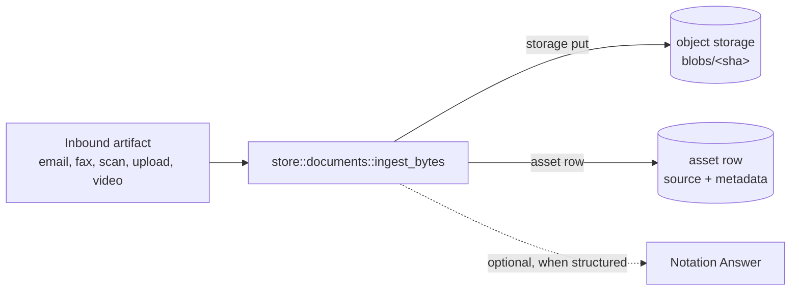

# Glossary

The vocabulary used across the Neon Law Navigator workspace. Most of these nouns are also table names in
[`store`](../store/) — the definitions below cite the canonical store module or Surreal schema, so a reader can jump
straight from term to schema.

This glossary is a single alphabetical list. The notation-system vocabulary (Template, Notation, Questionnaire,
Question, Answer, Rule) lives in its own teaching-ordered doc, [`notation.md`](notation.md).

For task-oriented navigation, start at [`index.md`](index.md). Its glossary quick links map the most common terms to the
docs that explain how those terms behave in code, operations, and workflows.

---

## Actor Class

Who advances the workflow out of a given State:

- **system** — driven by a background step (e.g. rendering, sending an email). **lawyer** — a Neon Law Navigator
  operator must take action. **respondent** — the client must take action (e.g. sign).

See [`workflows::step::step_kind_for`](../workflows/src/step.rs).

## Address

A postal address attached to a Person, to an Entity, or to neither (the mailroom placeholder). The person/entity
exclusivity is enforced by the application, not the schema.

- Schema and queries: [`store::addresses`](../store/src/addresses.rs) (SurrealDB; #1093, ENG-20) —
  [`store/src/schema/navigator.surql`](../store/src/schema/navigator.surql)

## AIDA

The workspace's **domain agent persona**. AIDA exposes the same tool catalog through two protocol surfaces — A2A and MCP
— so clients across the ecosystem can drive Neon Law Navigator's workflows without caring which underlying LLM does the
routing.

- **A2A** (Agent2Agent) — session-gated agent card at `/app/api/aida.json`,
  JSON-RPC at `/app/api/aida/rpc`. Used by Gemini Enterprise and any other A2A-compatible orchestrator. A free-form
  `message/send` is interpreted by a pluggable [`AgentRouter`](../portal/src/agent_router.rs) (Vertex AI Gemini Flash in
  prod) that maps the user's text to one of the declared tools.
- **MCP** — JSON-RPC at `/mcp`. Used by Claude.ai Connectors, Claude Code, LibreChat, and other Anthropic-stack
  clients. The MCP-side LLM (e.g. Claude) does its own tool routing client-side; our server just dispatches the named
  tool.

AIDA is **LLM-agnostic** by design — the router behind A2A is one implementation of a trait that could be swapped for
Claude (direct or via Vertex AI Model Garden), a local model, or even a rules engine without touching the tool catalog
or the A2A wire format.

Skill names are mirrored across both protocols by [`mcp::tools::list_tools()`](../mcp/src/tools/mod.rs): MCP clients see
them prefixed with `aida_` (`aida_create_person`); A2A clients see the unprefixed form (`create_person`) since AIDA
herself is the namespace.

- Card builder: [`portal::a2a`](../portal/src/a2a.rs) Router trait:
  [`portal::agent_router`](../portal/src/agent_router.rs) Tool registry: [`mcp::tools`](../mcp/src/tools/mod.rs)

## Analysis

The workflow prefix `analysis` is a system wait state for review-in matters: the web app performs the contract analysis,
persists the findings, and signals the workflow when `analysis_ready` is available. See
[`notation-authoring.md`](notation-authoring.md#changing-the-workflow-composition) and
[`workflows::step::STEP_PREFIXES`](../workflows/src/step.rs).

## Asset

One row in the `assets` table: the canonical store for a static byte artifact. It holds the byte pointer (content type,
byte size, SHA-256, and the storage key from [`cloud::StorageService`](../cloud/); the bytes live in object storage)
plus, for a matter document, its metadata. Two shapes: a **document asset** (project-scoped, with
`filename`/`kind`/`source`/`received_at`) and a **bare content asset** (a template body or raw `.eml`, those columns
null). Storage is content-addressed (`blobs/<sha>`), deduped by `sha256_hex`. Merges the former `blobs` + `documents`
split (#449). `visibility` (`internal`, the default, or `client`) gates whether a document asset reaches the client
portal's matter-detail listing and "download all documents" archive; every ingest call site states it explicitly (#782).

- Schema: [`asset` in `navigator.surql`](../store/src/schema/navigator.surql) (SurrealDB; #1093, ENG-121) · Write lanes:
  [`store::documents::ingest_bytes`](../store/src/documents.rs) (document assets),
  [`store::assets::ingest_content`](../store/src/assets.rs) (bare content).

## Authority

One case, statute, regulation, administrative proceeding, or secondary source, as **global reference data**. An
Authority carries its citation, its title and publisher, its canonical URL, and an archived artifact so it survives link
rot. It is deliberately **not case-shaped**: a statute is a first-class Authority, not a case record with its fields
bent to fit.

An Authority carries **no `project_id`**. The same authorities recur across matters, and a matter's *use* of one is a
separate scoped record holding which side relies on it (`ours`, `adverse`, `neutral`) and what the firm did with it.
This is the participation shape — global entity, scoped relationship — and inverting it would leak one matter's
litigation posture into another matter's view of the same case.

The disposition on a matter's use is a closed taxonomy. Several of its values (`reviewed-not-used`,
`record-exhibit-not-relied-on`, `captured-exhibit-not-quoted`, `monitoring-not-relied-on`) record **firm reasoning** —
what the firm considered and chose not to rely on. A client who sees "reviewed, not used" learns the firm's strategic
assessment of their own matter, which discloses work product rather than merely data, so none of them may ever enter a
client-facing allowlist.

A composition references an Authority by id and the server resolves it under the lens gate. Embedding citation prose
instead is the failure mode: it drifts from the record and cannot be re-verified.

- Vocabulary: [`rules::citation`](../rules/src/citation.rs) · Schema:
  [`authority` in `navigator.surql`](../store/src/schema/navigator.surql) Queries:
  [`store::authorities`](../store/src/authorities.rs) Lives in: the `authority` table in SurrealDB

## Brand

The public face a binary publishes. **The brand is the binary, not a flag**: each brand crate compiles one
[`portal::hosting::Brand`](../portal/src/hosting.rs) naming its telemetry service and the public routes it composes, and
mounts the identical Navigator application beneath it. There is no runtime switch, so a misconfigured deployment cannot
serve one entity's pages under another entity's tag.

Two shapes ship:

- **`neon`** — [the whole site](../neon/src/lib.rs), served at `www.neonlaw.com`: the law firm, at the root and nowhere
  else. It is also the only binary that mounts the [Presentation](#presentation) and workshop catalogs. Single-word
  crate name, matching its siblings; the public domain and display brand live in the site configuration, not in the
  crate name.
- **`tenant`** — [the white-label shape](../portal/src/tenant.rs), which publishes no public face at all and redirects
  its bare host into the portal. It lives inside `portal` rather than in a crate of its own because a tenant has no
  brand to compose — that is the entire point.

Distinct from [`views::brand::SiteBrand`](../views/src/brand.rs) (`FIRM_BRAND`), the presentation half: the strings, nav
links, and footer attribution a page renders, overridable by a mounted `BrandManifest`. One names *the serving binary*
and the other *what the page says*.

- Deployment map: [`environments.md`](environments.md#why-the-brand-is-the-image)

## Brand Seed

The seed layer a [Brand](#brand) owns, applied on every boot of that binary **including production**. It carries the
data one brand holds and another must not: `neon` seeds the Firm's own entities and postal identities, and `tenant`
seeds none of ours at all ([`store::seed::BrandSeed`](../store/src/seed.rs)).

The canonical layer keeps the *shared registry* — the firm anchor and the identities every deployment resolves by name.
An entity no deployment of ours does business as belongs nowhere in these layers at all, which is what keeps a `tenant`
boot carrying none of our corporate records.

It is the middle of three layers in [`store::seed`](../store/src/seed.rs), and the distinction that matters is which
reach production:

1. **Canonical** — the shared identities, reference data, and catalog. Every brand, every environment.
2. **Brand** — this layer. The booting brand only, every environment.
3. **[Sample matter fixture](#sample-matter-fixture)** — three synthetic matters, their local participants, and
   their supporting rows. Applied only where the matters are sample, so the shared examples are ready whenever local
   development starts and never reach a deployment holding real files.

A brand declares its `BrandSeed` in the `Brand` value it hands to the shared run loop, so the seed set is chosen by
which binary is running rather than by configuration. The Firm's mailboxes sit alongside other entities' at one mail
center, sharing a street, a suite, and a ZIP and differing only in the box number — which is why "seed them all
everywhere" reads as correct in any test that merely counts rows, and why the layer exists.

## Certified Mail

The workflow prefix `certified_mail` records a lawyer-driven outbound certified-mail submission. It is an outbound
submission step and must sit behind [Lawyer Review](#lawyer-review). See
[`notation-authoring.md`](notation-authoring.md#changing-the-workflow-composition) and
[`workflows::step::STEP_PREFIXES`](../workflows/src/step.rs).

## Client Review

The workflow prefix `client_review` lets the respondent review and approve attorney-approved drafts before a later
signature or closing step. See [`notation-authoring.md`](notation-authoring.md#changing-the-workflow-composition) and
[`workflows::step::STEP_PREFIXES`](../workflows/src/step.rs).

## Conflict-Check Graph

The graph the firm walks **before opening a matter** to decide whether the new engagement would conflict with a client
it already serves. Every node is a [Person](#person) or an [Entity](#entity); every edge is a typed relationship between
two of them.

The graph **is** the store (ENG-120). Its two edge tables are Surreal-resident, and `store::conflicts` traverses them on
the deployment's own connection:

- `entity_role` — structural ties (manages / owns / member-of), always full confidence, written as
  `RELATE person->entity_role->entity`. Owned by [`store::entity_roles`](../store/src/entity_roles.rs).
- [`relationship`](#relationship-edge) — the supplemental typed edges: adversity, related-party, and edges an LLM later
  parses out of a [Relationship Log](#relationship-log)'s free-form detail. Written as `RELATE
  (person|entity)->relationship->(person|entity)`, owned by [`store::relationships`](../store/src/relationships.rs).

It was once a *transient view*: each check loaded the rows and projected a name-only copy into an embedded in-memory
SurrealDB that was dropped with the check. That projection was deliberately written in the shape the persistent store
would hold, so making the rows resident deleted the projection — and its separate schema file — rather than rewriting
the traversal.

The engine walks — one bounded SurrealQL query collects every edge within three hops of the anchors — and Rust scores:
the confidence product along a path and the review/block floors are conflict judgments, not graph operations. The
traversal is read-only by construction, which matters more now that it runs against the live store than it did against a
throwaway one.

A check anchors on the proposed client and entity and surfaces every distinct firm-served party it reaches. It reads
**across matters, unscoped**, because imputed conflicts under Model Rule 1.10 live on other people's matters; the
containment is that only firm-side create paths call it (see
[`access-model.md`](access-model.md#where-surrealdb-authorization-lives)). Findings are **advisory to clear,
authoritative to block**: a confident, direct `adverse_to` link to a current client hard-stops the open; softer
entanglements (a shared entity, a recorded [Disclosure](#disclosure)) are flagged for authorized lawyers to acknowledge
— recorded to the [Relationship Log](#relationship-log) when they do. The graph can *raise* a conflict; only a person
can *clear* one, because it is never assumed complete.

It runs on every create path (portal, [AIDA](#aida) MCP tool, CLI); the non-interactive paths have no acknowledgment
seam, so any finding refuses the open and routes lawyer to the portal.

- Engine: [`store::conflicts`](../store/src/conflicts.rs), which traverses the resident graph. See
  [multi-cloud](multi-cloud.md) for the deployment shape.

## Council

A **group of experts** the workspace convenes for a structured, twelve-voice review — spelled c-o-u-n-c-i-l.

Neon Law Navigator runs three, the same shape with a different bench:

- The **Engineering Council** (the "Council of Twelve") — twelve practitioner-engineer voices for architecture
  decisions, design planning, and cross-cutting refactors.
- The **Legal Council** — twelve lawyer voices for legal-drafting copy review, before copy becomes a
  [Notation](notation.md#notation). Exposed to external agents as the `aida_spawn_legal_council` MCP tool.
- The **Client Council** — twelve client-side voices for intake, portal UX, pricing, onboarding, and other decisions
  where the question is whether a real person walks in and stays.

The Legal Council is **a council of [counsels](#counsel)** — a council (the group) whose members are counsels (the
attorneys). Both spellings are load-bearing; see [Counsel](#counsel).

See [`agent-decision-councils.md`](agent-decision-councils.md) for the shared protocol.

## Counsel

An **attorney** — spelled c-o-u-n-s-e-l. The members of the [Legal Council](#council) are counsels; "ethics counsel,"
"Senior Counsel," and "trial counsel" all use this spelling. Outside counsel working one of the firm's matters is a
`lawyer` [Person](#person), not a separate [Participation](#participation) word. Distinct from [Council](#council)
(c-o-u-n-c-i-l), which is the *group*: the Legal Council is a council of counsels. [AIDA](#aida) is the agent that
carries the Legal Council tool — it is neither a counsel nor the name of the council.

## Coverage Finding

One assessment of whether an [Inquiry](#inquiry) has been answered during a Live Inquiry Session. A finding may be
model-authored or lawyer-authored, and it cites transcript evidence; it is not a confirmed [Answer](notation.md#answer)
until a lawyer turns it into one.

- Design: [`live-inquiry-coverage.md`](live-inquiry-coverage.md)

## Credential

A Person's licensure in a Jurisdiction — pairs a Person with a Jurisdiction and a state-issued `license_number`. The
pair `(person, jurisdiction)` is unique so the same attorney can't be double-listed under one jurisdiction.

- Schema and queries: [`store::credentials`](../store/src/credentials.rs) (SurrealDB; #1093, ENG-19, ENG-20) —
  [`store/src/schema/navigator.surql`](../store/src/schema/navigator.surql)

## `ctx.run`

The journaled **side-effect primitive**. Wraps any non-deterministic operation — a store write, an outbound HTTP call,
reading the wall clock — so its result is recorded in the invocation journal the first time and **reused from the cache
on replay** instead of re-executed.

```rust
// workflows-service::notation_service::questionnaire_signal
ctx.run(|| async move {
    let recorded_at = chrono::Utc::now().to_rfc3339();
    append_event(db.as_ref(), TransitionRecord { … })
        .await
        .map(|_| ())
        .map_err(|e| HandlerError::from(TerminalError::new(format!("journal: {e}"))))
})
.name("append-questionnaire-event")
.await?;
```

What this buys, concretely:

- **No double-writes on crash.** If the worker dies after the `INSERT` commits but before the handler returns, Restate
  replays the handler from the journal. The replay hits this `ctx.run`, sees a cached result, **skips the `INSERT`
  entirely**, and returns the original value.
- **Idempotent in spite of retries.** Restate retries failed invocations until they terminate. Without `ctx.run`, every
  retry would re-run the side effect; with it, only the first attempt that committed a journal entry actually runs.
- **The stable identifier matters.** `.name("append-…")` is how Restate matches a journal entry to a `ctx.run` site
  across handler versions. Rename it and a replay loses the cache hit.

If the handler does **not** wrap a side effect in `ctx.run`, the side effect runs once per replay — that's the
"double-row in `notation_events`" failure mode the design carefully avoids.

## Data Export

A snapshot of one or more SurrealDB tables, written to Parquet (and eventually Iceberg metadata) on a dedicated GCS
bucket, consumed by BigQuery via BigLake external tables. The [`archives`](../archives/) crate owns the writer, exposed
as the `Archives` Restate workflow hosted by the `workflows-service` worker (all workflows live there). The
[`cron-archives-trigger.yaml`](../examples/deploy/k8s/exports/cron-archives-trigger.yaml) CronJob fires nightly at 02:00
Pacific to start one invocation; the workflow runs the snapshot (and, when configured, a GCP cost-by-service summary
written as the `gcp_cost` table) as durable steps, then posts a diagnostic summary (snapshot outcomes, cost summary,
BigQuery query template, Restate invocation link) through the worker's `SLACK_WEBHOOK_URL` notifier.

Disambiguates from the deploy **source export** — that ships git bundles of HEAD to `gs://YOUR_PROJECT_ID-source/` for
repo distribution. Two buckets, two flavors of "export," one shared word.

- Crate: [`archives/`](../archives/) Bucket: `gs://YOUR_PROJECT_ID-exports/iceberg/<table>/`

## Deadline

A forward-dated obligation on a [Project](#project) — a pleading due, a filing due, a statutory window closing. This is
the firm's docket: a missed deadline is a malpractice event, not a backlog item. Deadlines are the one forward-looking
record in the schema. [Notation Event](#notation-event) is an immutable journal and is past tense by construction, and
[Filing](#filing) names a workflow step that runs, not a date it is due by.

The table is `project_deadlines`. [Matter](#matter) is client-English for the same row, and lawyer-facing copy may say
"matter deadline", but the schema speaks `project` without exception — every other table already does.

**Authority.** Every deadline records *why the date binds*: a closed `authority_kind` vocabulary — `statute`,
`court_rule`, `court_order`, `contract`, or `internal` — beside a free-text `authority` citation such as `15 U.S.C. §
1681i(a)(1)` or a court-order reference. "Statutory" stays a queryable distinction rather than collapsing into a general
bucket, and a deadline nobody can justify cannot be written: `statute` and `court_rule` both require a citation.
Distinct from `source`, which records the *producing workflow* — or `lawyer` for a hand-entered date — not the
authority.

**Stored, never derived.** The due date is written down, not recomputed at read time. A rule can change — a statute is
amended, a court rule is revised — and recomputing would silently move a date the firm already docketed and relied on.
The stored date is the one malpractice exposure attaches to; `authority` records the rule that produced it, so the
derivation stays auditable. Computing court days (per jurisdiction, with holiday calendars and service-method
extensions) is deliberately out of scope — a deadline must never *pretend* to have counted court days.

**Two lead times.** A deadline carries separate internal and client lead times, because the firm is warned before the
client is: the internal lead is never shorter than the client lead. Either may be unset, and an unset client lead means
the client is never warned about that date.

**Idempotency is explicit.** A workflow-written deadline carries a `replay_key` so a replayed [`ctx.run`](#ctxrun) step
updates its row instead of duplicating it. A hand-entered deadline leaves the key unset, so two genuinely different
pleadings sharing a kind and a trigger date stay two rows — an idempotency key, not a natural key that silently merges
malpractice-relevant records.

## Deployment Environment

The infrastructure profile selected by `NAVIGATOR_ENVIRONMENT`. Exact `dev` serves local KIND; exact `production`,
empty, or unset serves production. The parser reports every other value as an error. `NAVIGATOR_CI_HARNESS` adds fake
providers to the `dev` profile for automated tests.

Every profile applies the canonical seed and the [Brand Seed](#brand-seed). Whether the [Sample Matter
Fixture](#sample-matter-fixture) is applied on top is a *separate* selector, `NAVIGATOR_SIMULATED_MATTERS`, which
defaults to following this one and can be set explicitly either way. The combination that needs the second selector is
the persistent staging deployment: it runs the `production` profile deliberately, so nothing in the process could
otherwise tell it apart from the deployment holding real matters.

## Deployment Operator

The person or automation that owns Kubernetes, cloud accounts, secrets, domains, mounted deployment configuration, and
rollouts. This is distinct from an application [Role](#role): a Person with `persons.role = 'admin'` has application
authorization but does not thereby gain infrastructure access.

## `devx`

The **developer-environment orchestration** for this workspace, part of the `navigator` CLI (the `cli` crate),
implemented in the [`cli/src/devx/`](../cli/src/devx/) module — there is no separate `devx` crate or binary. This is
distinct from [DevX API](#devx-api), the GitHub webhook system in the `github_webhooks` crate. Brings a complete
dependency stack up inside a local KIND cluster — SurrealDB, Garage, Rauthy, Restate (operator-managed), embedded Rego,
plus the `workflows-service` Restate worker — opens host port-forwards and writes `.devx/env`. That file has the
connection details the host-side `cargo run -p neon` needs.

```bash
cargo run --release -p cli -- dev up      # bring it all up
set -a; source .devx/env; set +a       # connection env vars
cargo run -p neon                       # host-side web on :3001
cargo run --release -p cli -- dev down    # tear it all down
```

Subcommands:

- `dev up` — KIND + nginx-ingress + Restate Operator + every dep + workflows-service + port-forwards + env file. The
  `web` binary is left for the host to run.
- `dev down` — kill port-forwards and delete the KIND cluster. `dev env`, `dev status` — print the env file / show
  whether port-forwards are alive. `dev kind up`, `dev kind down` — just the cluster + ingress + Operator (no
  application manifests). `dev deploy` — full in-cluster stack including `navigator-web`. It idempotently sets the
  cluster up, **pulls** the published service images (`NAVIGATOR_IMAGE_TAG` or the latest `YY.M.D`), retags them to
  `:dev`, `kind load`s, applies every manifest, waits for the navigator-web rollout. CI builds the images; the local
  loop no longer builds them.
- `dev undeploy` — `kubectl delete namespace navigator`. `dev worktree-env up/down/status` stands up or tears down a
  per-worktree KIND environment (its own dependencies, Restate journal, `navigator` database, and host ports; `--branch`
  branches a supplied checkout in place or creates a sibling worktree; `--demo` runs the in-cluster stack). `dev e2e`
  smoke-tests rollouts, `/health`, embedded Rego decisions, and local seed counts. `dev grant-lawyer` pre-seeds the
  Lawyer demo user for browser e2e with the `lawyer` role. `ops ship` — one-shot production roll that pins service
  deployments to a named `--tag` and re-registers. `dev logs` — tails navigator-web logs.

The workspace has no Makefile — the `navigator` CLI is the only entry point.

## DevX API

The GitHub-driven issue-to-PR ingress system in the [`github_webhooks`](../github_webhooks/) library crate, shared by
two binaries. The receiver is the `POST /webhooks/github/{secret}` route on `workflows-service`, the public `workflows`
host (GitHub cannot reach `www`, which goes behind the tailnet): it verifies signed GitHub deliveries and submits typed,
body-free commands to the Restate ingress. The durable Slack-notice services `DevxIssueTriage` and `devx-pr` bind into
`workflows-service` alongside the other durable workflows and turn those commands into engineering notices; they alone
read `SLACK_WEBHOOK_URL`. The GitHub App client, Kubernetes orchestration, and fuller durable workflows are distinct
components.

## Directly Responsible Individual (DRI)

The natural [Person](#person) accountable for a [Matter](#matter) — the name to ask "where does this stand?". Every
matter carries **two sides** of accountability, seeded at matter-open, and each side is a **set**:

- **Lawyer DRIs** — the attorneys/admins accountable for the matter inside the firm. The opening lawyer by default
  (else the firm principal, resolved by role). A matter always has at least one; it may have several, which is how one
  matter is genuinely two lawyers' responsibility rather than one lawyer's with a note.
- **Client DRIs** — the **client-side** people accountable for the matter. Each must be a real, pre-existing
  [Person](#person) with `role = client` (never a firm attorney — a matter's client of record is a client). The client
  field exists before the project; the matter is opened *for* that client.

Each is an **accountability marker on the person's participation row** — `person_project_role.is_lawyer_dri` and
`is_client_dri`, booleans any number of rows per matter may carry. A DRI is therefore a matter person **by
construction**: the marker lives on the membership row, so there is no way to name a DRI who is not on the matter. The
participation ledger still records the broader involvement/access it always did (a `client` participation for portal
visibility, co-counsel, other lawyers); the DRI flags single out *who is accountable* on each side. Participation
answers "who's involved and what can they see?"; the flags answer "who owns this?".

Two rules bound the sets, both enforced in `store::participation` rather than by the schema — SurrealDB has no partial
unique index, so the cardinality rules live in Rust where they can be tested:

- **The lawyer set is never empty.** The last accountable lawyer cannot step off and cannot be removed from the matter.
- **Changing either side is authorized and audited.** A matter's lawyer DRIs govern their own side — any of them may
  add or remove any other — while the client side takes the lawyer tier and above. Owner and Admin pass both. Every
  designation and removal appends a `relationship_log` entry naming the actor, the matter, and the person moved.

A matter is opened against a pre-existing [Entity](#entity), **for** a pre-existing client, **and** always on a
[retainer](#engagement--retainer) — a project is not official until a retainer exists. The matter-open service validates
the entity and the client role before any row is created.

- Schema and command: [`store::projects`](../store/src/projects.rs) (the `is_lawyer_dri` / `is_client_dri` fields);
  `store::projects::designate_dri_in_surreal` writes the membership record and its marker as one act
- Rules, authorization, and the audit write: [`store::participation`](../store/src/participation.rs)

## Disclosure

A formal disclosure attached to an Entity or a Project (conflicts, related-party, etc.). A `conflict` / `related_party`
disclosure on an entity is read by the [Conflict-Check Graph](#conflict-check-graph) and surfaced as a review-level
finding when a new matter reaches that entity.

- Commands: [`store::disclosures`](../store/src/disclosures.rs) · Schema:
  [`disclosure`](../store/src/schema/navigator.surql)

## Docket Entry

One typed, numbered entry on a litigation case's docket — the court's own record of what was filed or served. The
generic spine every case record hangs off, mirroring how a court docket actually works: a numbered list of typed entries
rather than a table per instrument. A new niche instrument type is one value in the closed, code-extended `kind` set,
never a migration.

The entry number is **text, not an integer**. Real dockets use attachment sub-numbers such as `29-1`, and an entry list
has to reference them exactly.

An entry with **no document attached is a meaningful state**, not an error: it renders as *source pending*.
Staged-versus-pending is derived from whether the document link exists, never from hand-maintained copy.

**Docket belongs to litigation.** The case docket is the court record of filings. The cross-practice surface answering
*what is due* is the Deadlines module — litigators speak of *docketing* and corporate lawyers of a *compliance
calendar*, but each maps to one schema noun, the same way Matter maps to Project. This module records what exists; the
Deadlines module answers what is due.

- Commands: [`store::cases`](../store/src/cases.rs) · Schema:
  [`case_docket_entry`](../store/src/schema/navigator.surql)

## Document

A matter document — a project-scoped [Asset](#asset) carrying the metadata callers see (`filename`, `kind`, `source`,
`received_at`) alongside the byte pointer.

> **Source of truth = the assets row.** When the application generates or proxies a document (a rendered retainer PDF, a
  raw inbound email body), the bytes land in object storage via [`cloud::StorageService`](../cloud/) and the `assets`
  row is the canonical record. A planned sync writes a mirror copy into the Project's archive folder so the lawyer's
  "open the matter" view stays complete — but the assets row, not the archive copy, is the row the schema, the audit
  trail, and the application's read path point at.

- Schema: [`asset` in `navigator.surql`](../store/src/schema/navigator.surql) Queries:
  [`store::assets`](../store/src/assets.rs) Lives in: the `asset` table in SurrealDB (document-shaped rows)

## Document Drafts

The workflow prefix `document_drafts` is a system wait state for web-rendered review-document rows, used by workflows
that generate multiple client-reviewable instruments. See
[`notation-authoring.md`](notation-authoring.md#changing-the-workflow-composition) and
[`workflows::step::STEP_PREFIXES`](../workflows/src/step.rs).

## Document Identity

The `(project_id, slug)` pair naming a **living document** in the asset lane — the thing a re-upload updates rather than
duplicates. Deliberately **not unique**: every `assets` row under a slug is one [Revision](#revision) of that document,
S3-style. A null `slug` means a one-off artifact (an inbound attachment, an executed PDF nobody will revise) that is a
revision of nothing.

The slug is lawyer-chosen and never derived from the filename: a re-upload named `captable_final_v2.pdf` must not fork a
chain, and two unrelated `agreement.pdf` files on one matter must not merge into one. `kind` is immutable across a chain
— a changed kind is a different document, and belongs under its own slug.

Only the asset lane has slug versioning. The notation lane versions already: `templates.is_current` appends a row per
change and every Notation pins a template row.

- Write boundary: [`store::assets::file_revision`](../store/src/assets.rs) · Schema:
  [`asset` in `navigator.surql`](../store/src/schema/navigator.surql)

## Document Intake

The workflow prefix `document_intake` files an inbound artifact, such as a transcript or executed PDF, into the matter
through the shared document-ingestion path. See
[`notation-authoring.md`](notation-authoring.md#changing-the-workflow-composition) and
[`workflows::step::STEP_PREFIXES`](../workflows/src/step.rs).

## Document Open

The workflow prefix `generate_pdf` renders a template body into a Blob-backed document for the Project. See
[`notation-authoring.md`](notation-authoring.md#changing-the-workflow-composition) and
[`workflows::step::STEP_PREFIXES`](../workflows/src/step.rs).

## Durable execution

The property the [Workflow Runtime](#workflow-runtime) gives the application. Once a Notation has emitted a signal (say,
`retainer_rendered`), the transition is recorded somewhere that survives process restarts; replay reaches the same
terminal state even if the worker crashes mid-flight. [Restate](#restate) provides this property in production;
`InMemoryRuntime` is a non-durable simulation for tests and local dev.

## E-Filing

The workflow prefix `e_filing` records an electronic government filing. It is an outbound submission step and must sit
behind [Lawyer Review](#lawyer-review). See
[`notation-authoring.md`](notation-authoring.md#changing-the-workflow-composition) and
[`workflows::step::STEP_PREFIXES`](../workflows/src/step.rs).

## Email Send

The workflow prefix `email_send` renders and sends a bundled outbound email template through the configured email
service. See [`notation-authoring.md`](notation-authoring.md#changing-the-workflow-composition) and
[`workflows::step::STEP_PREFIXES`](../workflows/src/step.rs).

## Engagement / Retainer

Client-English synonym for **[Notation](notation.md#notation) bound to a Project**. An Engagement is what the firm
sells; under the hood, running an Engagement means creating a Notation, walking its Questionnaire, advancing its
Workflow, and rendering its document.

The **engagement is a matter's first Notation**: a [Project](#project) is opened first (its own step — `navigator db
project create` — which seeds the client and lawyer participation), then the engagement is created on it like any other
Notation (`navigator site notation create <retainer_code> --project <code>`). Opening a Project never opens a Notation
with it; no door creates a retainer alongside the matter.

The engagement-first rule is enforced at create time on the **self-serve doors** — `web`'s project-scoped create route
and the CLI, which share `workflows::notation_session::create_notation_from_repo`. There, a matter's first Notation must
be a template whose declared `kind` opens a matter — see [Onboarding](#onboarding). One classifier answers that for the
whole workspace, `rules::kind::Kind::opens_a_matter`; see [`docs/frontmatter.md`](frontmatter.md) for the `kind`
vocabulary. Later Notations — filings, letters — may be any kind.

**[AIDA](#aida) is not bound by that rule**, because it is lawyer-directed rather than self-serve.
`aida_create_notation` opens the notation through the policy-free `start_notation` primitive, so an attorney driving the
agent may bind a filing or letter as a matter's first Notation; gating the agent door would forbid the agent's ordinary
use. What constrains AIDA is authorization, not kind: the actor must be lawyer and in scope for the Project
(`store::projects::can_access_as_lawyer`), and the respondent is always the Project's client-side DRI.

A **Retainer** is the same idea, narrowed: an Engagement whose bound Template is the firm's engagement agreement,
`onboarding__retainer`. The `portal::retainer_walk` walker, the [`docs/retainer_intake.md`](retainer_intake.md) state
machine, and the firm's "signed retainer" disclaimer all refer to that specific kind of Notation.

The schema noun in both cases is `Notation`. Client-facing copy speaks Engagement and Retainer because clients do; the
database and the workflow runtime speak Notation.

## Entity

A legal organization — an LLC, trust, corporation, foundation, etc. Has a name, an [Entity Type](#entity-type), and a
[Jurisdiction](#jurisdiction) it is organized under.

- Schema and queries: [`store::entities`](../store/src/entities.rs) (SurrealDB; ENG-120) — Lives in: `entity` table.
  Its `entity_type_id` and `jurisdiction_id` are real `record<>` links; the firm's own row is protected from forking by
  a claim in the `firm_anchor` table, whose record id is the anchor key, rather than by an advisory lock. The UNIQUE
  `entity_firm_anchor` index is the backstop behind it — it refuses a fork that is not a race, but racers write no
  shared key for the engine to conflict on, so the claim is what serializes them (ENG-272).

## Entity Type

The kind of legal Entity (`LLC`, `Trust`, `Corporation`, `Foundation`, …). Reference data, seeded from
[`store/seeds/EntityType.yaml`](../store/seeds/EntityType.yaml).

- Schema and queries: [`store::entity_types`](../store/src/entity_types.rs) (SurrealDB; #1093, ENG-20) —
  [`store/src/schema/navigator.surql`](../store/src/schema/navigator.surql)

## External System Identity

The identifier a third-party system issues for a [Person](#person) — a GitHub numeric id, a Slack `U…`, a Google `sub`,
a Linear uuid — so Navigator can name them in an API call. Creating a repository and putting the right people on it
means telling GitHub *which* user, and the API wants an id, not an email address; inviting someone to a Slack channel,
or as a Docusign envelope recipient, is the same problem.

Always the provider's **immutable** id, never the handle. Handles are renameable, and a mapping keyed on one breaks
quietly — the provisioning call simply fails to find a user, at exactly the moment a matter is opening. A display
`handle` is kept beside the id and is expected to drift.

**It carries no authorization meaning, and that is the point.** A row is an address, not a key and not a permission:
`persons.role` is the authorization tier and `person_project_roles.participation` is the scope, and an external identity
is neither. No code may read it to make an access decision. This is what keeps the [Clerk](#person) rule intact — a
Clerk recorded as GitHub user `12345` receives no Git authority by that record — and what keeps the table from becoming
a back door around the rule that Project participation never grants source-forge access. The vocabulary of systems is
closed and fails closed; the values themselves are unverified, so a wrong id is a data-entry bug and a stale row is
wrong data, not a security incident.

- Schema and queries: [`store::external_identities`](../store/src/external_identities.rs) (SurrealDB; ENG-85) —
  [`store/src/schema/navigator.surql`](../store/src/schema/navigator.surql)
- Inertness guard: `cli/tests/external_identity_is_inert.rs`
- Access model: [`access-model.md`](access-model.md#what-an-external-system-identity-is-not)

## Extract

The workflow prefix `extract` is a system wait state for structured-data extraction from a previously ingested artifact.
See [`notation-authoring.md`](notation-authoring.md#changing-the-workflow-composition) and
[`workflows::step::STEP_PREFIXES`](../workflows/src/step.rs).

## Filing

The workflow prefix `filing` records a named government filing. It is an outbound submission step and must sit behind
[Lawyer Review](#lawyer-review). See the
[`notation-authoring.md`](notation-authoring.md#changing-the-workflow-composition) guide and
[`workflows::step::STEP_PREFIXES`](../workflows/src/step.rs).

## Firm Signature

The workflow prefix `firm_signature` records a lawyer-side signature, usually the firm's countersignature or closing
signature. See [`notation-authoring.md`](notation-authoring.md#changing-the-workflow-composition) and
[`workflows::step::STEP_PREFIXES`](../workflows/src/step.rs).

## GitHub Issue

The workflow prefix `github_issue` opens a GitHub issue from a rendered `kind: github` notation — the engineering intake
shelf at `templates/github/`, not legal work, and therefore the one worker step that never sits behind [Lawyer
Review](#lawyer-review). GitHub is isolated behind the `workflows::github::IssueOpener` trait: the real
`RestIssueOpener` calls the REST API with `reqwest` and the runtime never shells out to the `gh` CLI, while the default
`NullIssueOpener` (no token configured) opens nothing and reports that, so a workflow can never claim an issue that does
not exist. See [`notation-authoring.md`](notation-authoring.md#changing-the-workflow-composition),
[`workflows::github`](../workflows/src/github.rs), and [`workflows::step::STEP_PREFIXES`](../workflows/src/step.rs).

## Ingestion

One inbound artifact landing on a [Project](#project) — an email attachment, a scanned letter, an upload from a client,
a fax, a client-supplied video. Each Ingestion lands **exactly one new `asset` row** carrying the channel name
(`source`), the upstream artifact's revision id (`source_revision_id`), and the channel's `received_at` timestamp; the
1:1 mapping between an `asset` row and the upstream revision id is the matter's audit trail. There is no `documents`
table — the former `blobs` + `documents` split merged into `asset` (#449); see [Asset](#asset).



Inbound channels share one entry point — `store::documents::ingest_bytes` — so the storage put + asset-row write happen
in one transaction. Per-channel data (email headers, fax metadata) belongs in per-channel tables (`inbound_emails`,
`inbound_faxes`) when those channels ship.

- Schema: [`asset` in `navigator.surql`](../store/src/schema/navigator.surql) Queries:
  [`store::assets`](../store/src/assets.rs) Lives in: the `asset` table in SurrealDB

## Inquiry

One thing a transcript-bearing session should answer. By default, an Inquiry is the normalized live-coverage projection
of a Template Question: the markdown Template declares the `questionnaire:`, the LSP/CLI validate it, and the Live
Inquiry Session tracks whether the transcript answered it. The term is broader than [Question](notation.md#question)
because deposition outline items, witness-prep prompts, and intake checklist items can also be Inquiries. An ordered
group of Inquiries is an **Inquiry Set**.

Use Inquiry rather than "interrogatory" for the generic product noun: an interrogatory is already a formal written
discovery device in litigation.

- Design: [`live-inquiry-coverage.md`](live-inquiry-coverage.md)

## Intake Persisted

The workflow prefix `intake_persisted` is a system wait state after questionnaire answers have been written and before
post-intake workflow work begins. See [`retainer_intake.md`](retainer_intake.md#post-intake-workflow) and
[`workflows::step::STEP_PREFIXES`](../workflows/src/step.rs).

## Jurisdiction

A US state, federal jurisdiction, or foreign jurisdiction that an Entity can be organized under, or that a
[Credential](#credential) is issued by. Identified by short code (`NV`, `CA`, `US`, …).

- Queries: [`store::jurisdictions`](../store/src/jurisdictions.rs) (SurrealDB; #1093, ENG-20) Schema:
  [`store/src/schema/navigator.surql`](../store/src/schema/navigator.surql) Seed:
  [`store/seeds/Jurisdiction.yaml`](../store/seeds/Jurisdiction.yaml)

## Lawyer Review

The workflow prefix `lawyer_review` is the mandatory human attorney/lawyer gate before a document is sent for binding
signature, certified mail, e-filing, or another outbound submission. A rejected review does not dead-end — it routes
`changes_requested → reask__client` to re-collect only the flagged answers (see [Re-ask](#re-ask)), and reserves
`rejected → END` for a genuine withdrawal. See
[`notation-authoring.md`](notation-authoring.md#changing-the-workflow-composition),
[`workflows::guardrail`](../workflows/src/guardrail.rs), and
[`workflows::step::STEP_PREFIXES`](../workflows/src/step.rs).

## Letter

One physical piece of mail, incoming or outgoing, scoped to a Mailroom.

- Schema and queries: [`store::letters`](../store/src/letters.rs) (SurrealDB; #1093, ENG-20) —
  [`store/src/schema/navigator.surql`](../store/src/schema/navigator.surql)

## Live Inquiry Session

One Project-scoped, transcript-bearing event — for example a Northstar sitting, deposition, witness interview, or client
intake call — evaluated against an [Inquiry](#inquiry) Set while the transcript develops. Transcript segments persist
immediately, speaker labels are provisional until mapped to a [Person](#person), and Coverage Findings remain proposed
until a lawyer confirms them.

- Design: [`live-inquiry-coverage.md`](live-inquiry-coverage.md)

## Mailroom

A physical mail-receiving destination — an Address with a name. Letters land here.

- Schema and queries: [`store::mailrooms`](../store/src/mailrooms.rs) (SurrealDB; #1093, ENG-20) —
  [`store/src/schema/navigator.surql`](../store/src/schema/navigator.surql)

## Mailroom Receive

The workflow prefix `mailroom_receive` records lawyer receipt of physical mail. See
[`notation-authoring.md`](notation-authoring.md#changing-the-workflow-composition) and
[`workflows::step::STEP_PREFIXES`](../workflows/src/step.rs).

## Mailroom Send

The workflow prefix `mailroom_send` records lawyer sending physical mail. See
[`notation-authoring.md`](notation-authoring.md#changing-the-workflow-composition) and
[`workflows::step::STEP_PREFIXES`](../workflows/src/step.rs).

## Matter

Client-English synonym for **[Project](#project)**. The same row, under the noun a lawyer or a client uses out loud.
*"Open a matter"* and *"open a Project"* describe the same insert into the `projects` table; the marketing surface picks
one, the schema picks the other.

## Module

A per-matter **capability**, enabled by lawyers on a Project. Every Project opens as a blank slate; practice-area
capability arrives as modules rather than as a project type, because one engagement can run litigation **and** a cap
table at once and a single type column cannot express that.

The set is closed — `litigation`, `cap_table`, `estate`, `deadlines` — and widening it is a deliberate enum addition
with a migration, never a free-text value invented at a call site.

**Presence of the ledger row is the enabled state.** Disabling deletes the row; there is no enabled flag and no disabled
timestamp. That keeps "is this module on" a single unambiguous question, and it is what makes the client lens
**toggle-blind by construction**: a disabled module has no row for any query to return, so there is no disabled state
for a response to leak. A client must never be able to infer that a module exists but was withheld — not by name, not by
a flag, not by an empty slot.

Disabling hides a capability; it never deletes what the module owns. Every toggle, in both directions, writes a
relationship-log entry naming the module and the actor.

- Commands and schema: [`store::project_modules`](../store/src/project_modules.rs) ·
  [`store/src/schema/navigator.surql`](../store/src/schema/navigator.surql)

## Neon Law Navigator

Short for **Neon Law Navigator** — the umbrella over this monorepo: the CLI (`navigator`), the one website (`neon` /
`portal` / `webapp`), the rule engine (`rules`), the MCP server, and everything else under this Cargo workspace. The
*code* is copyright **Shook Law PLLC**, the Firm that operates it under the NEON LAW mark and is the sole Licensor. This
is a **public, source-available repository — not open source**: one grant, `BUSL-1.1`, covers the whole tree including
the legal prose under `templates/`. Non-production use is free; production use needs a commercial licence, and each
version converts to `AGPL-3.0-only` four years after it is published. Outside contributions are closed for now, and work
in here assigns to the Firm ([`LICENSE`](../LICENSE), [`NOTICE`](../NOTICE), [`licensing.md`](licensing.md)).

*Matter work product* produced from the templates belongs to the client and the matter; the *name and marks* — "Neon
Law", "Navigator", "Neon Law Navigator", and the Neon Law logos — are reserved. **NEON LAW** is a registered trademark
of Shook Law PLLC, U.S. Reg. No. 6,325,650. See the [Trademarks note in `README.md`](../README.md#trademarks).

## Notarization

The workflow prefix `notarization` records a respondent signing or refusing in front of a notary. See
[`notation-authoring.md`](notation-authoring.md#changing-the-workflow-composition) and
[`workflows::step::STEP_PREFIXES`](../workflows/src/step.rs).

## Notation Event

One immutable journal row for a [Notation](notation.md#notation)'s state machine. Each row records the fact that a given
pair `(notation_id, machine_kind)` moved from one state to another via some condition, plus an optional opaque JSON
payload (the respondent's answer for questionnaire signals; `None` for workflow signals). The durable runtime appends
these so replay is deterministic, and the "current state" of a pair is the `to_state` of its latest row.

The on-disk shape mirrors the runtime type [`workflows::runtime::WorkflowEvent`](../workflows/src/runtime.rs); both
layers stay in sync because the worker writes them through `ctx.run`.

- Schema: [`notation_event` in `navigator.surql`](../store/src/schema/navigator.surql) Queries:
  [`store::notation_events`](../store/src/notation_events.rs) Lives in: the `notation_event` table in SurrealDB

## Offboarding

The codebase term for the notation that **closes a matter** — `rules::kind::Kind::Offboarding`, classified by
[`Kind::closes_a_matter`](../rules/src/kind.rs), the mirror of [`Kind::opens_a_matter`](#onboarding). In conversation
and with clients this is the **closing letter**: the firm-signed letter that confirms the representation is concluded,
seeded as `neon_law/shared/offboarding_letter.md` (`code: offboarding__letter`).

`store::projects::matter_lifecycle_sets` keys the matching lifecycle flag off this classifier — never off the template's
`code` — so a bespoke closing letter still clears the badge as long as it declares `kind: offboarding`. The Restate step
names inside that template's `workflow:` block (`generate_pdf__closing_letter`, `firm_signature__closing_letter`) and
the `closing_letter_storage_key` object-storage prefix are **deliberately frozen** at their old spelling — a Restate
step name is part of a durable journal, and the storage prefix already has objects filed under it, so renaming either
would orphan an in-flight invocation or an existing document rather than merely rename a word.

## On-Chain Record

The workflow prefix `onchain` records an attorney attestation in the durable attestation table and, when configured,
through the chain backend. See [`solana-attestation.md`](solana-attestation.md) and
[`workflows::step::STEP_PREFIXES`](../workflows/src/step.rs).

## Onboarding

The codebase term for the notation that **opens a matter** — `rules::kind::Kind::Onboarding`, classified by
[`Kind::opens_a_matter`](../rules/src/kind.rs). It covers both a single-instrument engagement letter and a
transcript-/intake-driven engagement that opens a bundle of instruments at once (the estate plan, the fractional-GC
engagement) — the same act of opening the matter either way. `Kind::Retainer` used to name the single-instrument case
separately; it has been merged into `Kind::Onboarding`, because no call site ever distinguished the two.

In conversation and with clients this is the **retainer** or the **engagement letter** — see [Engagement /
Retainer](#engagement--retainer) for that client-facing shape. The codebase and the workflow runtime speak Onboarding;
the templates that declare it keep their conversational titles ("Retainer Agreement", "Engagement Letter") and codes
(`onboarding__retainer`, `onboarding__engagement_letter`) unchanged — only their declared `kind:` collapsed to the one
value.

## Participation

The `person_project_roles.participation` column, and **nothing else**: participation is a property of a [Person–Project
Role](#personproject-role) row, never a standalone concept. That entry is the single definition — what the value is,
where it comes from, and which question its presence answers versus its value. Do not restate it here; two descriptions
of one column is how this glossary previously came to hold both "open vocabulary" and "closed derived set" at once.

Not to be confused with [Disclosure](#disclosure), which is the firm's conflicts log, not an access grant.

- See [`docs/access-model.md`](access-model.md) for the full role + participation model.

## Person

A human contact. The system-wide tier — `owner`, `admin`, `lawyer`, `clerk`, or `client` — lives on this row in the
`role` field, not on the OIDC token. The Rauthy / Google id_token carries only `sub` and `email`; the callback handler
links that pair to a Person via `oidc_subject` and reads `role` from the DB. `lawyer` means a person licensed to
practice law authorized for Navigator legal work, not a firm email or source-forge membership. See
[`docs/access-model.md`](access-model.md) and [`docs/oidc.md`](oidc.md).

This is a SurrealDB table and [`store::persons`](../store/src/persons.rs) is the only module that reads or writes it.
Every `person_id` on another table is therefore an unenforced cross-engine id, resolved in Rust.

One Person per mailbox is protected from forking by a claim in the `person_mailbox` table, whose record id is the
lowercased email, rather than by the UNIQUE `person_email_lower` index alone. The index is the backstop behind it — it
refuses a fork that is not a race, but racers write no shared key for the engine to conflict on, so the claim is what
serializes them (ENG-114). It matters here more than elsewhere because `role` is the authorization root: a forked
mailbox is one human carrying two roles. The claim moves when an edit moves the email and is released when the Person is
deleted, so a mailbox is reusable rather than locked out.

- Schema: [`person` in `navigator.surql`](../store/src/schema/navigator.surql) Queries:
  [`store::persons`](../store/src/persons.rs)

## Person–Entity Role

A Person's role within an Entity (e.g. `manager`, `member`, `beneficiary`, `trustee`). These are the structural ties the
[Conflict-Check Graph](#conflict-check-graph) walks at full confidence — the tie *is* the graph edge, `RELATE
person->entity_role->entity`, rather than a row projected into one.

There is no surrogate key: a tie's identity is its two endpoints plus its `role`, which is what the UNIQUE
`entity_role_tie` index says and what makes re-seeding idempotent.

- Schema and queries: [`store::entity_roles`](../store/src/entity_roles.rs) (SurrealDB; ENG-120) — Lives in the
  `entity_role` relation

## Person–Project Role

A Person's participation on a Project. The `participation` column records which side of the matter they are on, and it
is **derived, never entered**: `store::projects::participation_for_role` maps `persons.role` onto it, so the value is
one of `owner`, `admin`, `lawyer`, `clerk`, or `client`. No write door takes a participation — not the lawyer form, not
`POST /app/api/projects/{id}/participants`, not `aida_link_person_project`.

The row answers two questions, and they are not the same question. Its **presence** gates whether a `client` or `lawyer`
tier principal sees the Project at all. Its **value** decides which side of the matter that principal is on:
`store::projects::client_side_condition` matches the client side, and the firm lens
(`store::projects::firm_side_condition`) is its exact complement. Reaching the client's documents is narrower still,
keyed on `store::projects::client_document_condition`, which admits the natural-person `client` and the client-DRI
marker.

So "the row's presence is the signal" holds only for the first question. It is also true of the Rego layer, which reads
no participation value at all — but a `store` caller that treats presence alone as the signal collapses the firm lens
into the client-side set and hands an adverse party the lawyer workbench.

Values are stored folded — trimmed, lowercased, separators as single underscores — so one kind is one value. See
[`docs/access-model.md`](access-model.md).

- Schema: [`store::projects`](../store/src/projects.rs) ·
  [`store/src/schema/navigator.surql`](../store/src/schema/navigator.surql)

## Presentation

A repo-authored deck of teaching or speaking material. Presentations live only at the top-level `/presentations`
catalog; workshops live only at the top-level `/workshops` catalog. There is no prefixed aggregate or umbrella program.

**Presentations are anonymous.** The talks catalog renders at `/presentations` and each talk reads beneath it, under the
firm's chrome, with no rule in `navigator.rego` at all.

**Workshops are anonymous too.** The `/workshops` catalog page and the class material beneath `/workshops/{slug}` both
mount under the firm's chrome with no session boundary, alongside the talks. The repository is open source and the
classes teach the software it publishes, so gating them would put a login door in front of the one document explaining
how to run what anyone can already clone. The certificate `POST` keeps its own gate — who may *claim* a completion
certificate stays an authorization question even when the material is free to read.

Presentation and workshop material is **repo-authored, and stays that way**. The markdown under
[`server/content/workshops/`](../server/content/workshops/) is indexed by a hard-coded manifest in
[`portal::workshops::loader`](../portal/src/workshops/loader.rs): a file the manifest does not name is not published
material, and frontmatter is stripped rather than read. That is deliberate rather than incidental, because two guards
assert the published material agrees with the repository and neither one survives a move into the database — one holds
every code slide byte-identical to the workspace file it cites, and one asserts the Operating workshop's Environment
Matrix names every key in `.env.example`
([`server/tests/deploy_workshop_environment.rs`](../server/tests/deploy_workshop_environment.rs)). A slide is a claim
*about this repository*, so the repository is what checks it.

A [Workshop](#workshop) is the matter someone enrols in, which may teach from the repo-authored material — two nouns,
deliberately.

## Project

A **[Matter](#matter)** in client English. The durable container every [Notation](notation.md#notation) lives in. Has a
`status` (`open`, `closed`, `archived`) and is **always opened against an [Entity](#entity)** — a legal organization, or
a `Human` entity for a solo natural person. The `entity_id` FK is `NOT NULL`: a matter without an entity is a bug.

**Every Notation belongs to exactly one Project.** The schema enforces this with a `NOT NULL` `project_id` FK on
`notations`. A Notation without a Project is a bug.

Opening a Project never opens a Notation with it. The lawyer creates the engagement afterwards, on the Project, like any
other Notation — through `web`, the CLI, or AIDA. Every door works this way: none auto-creates a retainer alongside the
matter, and AIDA's `aida_create_notation` names the Project it acts on rather than opening one of its own.

Each Project has **one** deployment-scoped source repository, named for its `code`, holding that Project's notation
templates under `templates/` and its client portal under `portal/`. It contains source only; legal files, client
material, answers, and produced documents remain in the deployment's private documents bucket (prefix `projects/<code>`)
and Navigator [Assets](#asset). Google Drive stays as a per-Project ingest dropbox — Workspace users drop files in;
Navigator copies them into the documents bucket and never treats the folder as a live store.
[`project-repositories`](project-repositories.md) is the canonical deployment map and source boundary.

`projects.code` is **lowercase letters, digits, and single hyphens**, alphanumeric at both ends, at most 80 characters —
enforced by [`store::projects::is_valid_code`](../store/src/projects.rs) and the SurrealDB `project_code` unique index.
No uppercase, no underscores, no other punctuation, and no spaces.

**The code is the matter's URL.** Its show page is `/app/projects/{code}` and its client portal is
`/app/projects/{code}/portal/`; the internal UUID appears in neither. That holds because both directions read the `code`
column and neither consults the id — `portal::dioxus_app::project_show_path` writes a code into every link Navigator
renders, and `project_id_from_path` reads one back. A lowercase UUID is itself a well-formed code, so nothing could
refuse one on sight; what keeps ids out of URLs is the lookup, not the shape of the segment.

The code is **required at matter-open and never derived**: `code` names the matter's Drive ingest folder
and its object-storage prefix, and that mapping is an equality check, so a code Navigator invented would name no folder.
(`code_from_name` remains available to fixture and internal callers that are not matter-opens.) Uppercase and
underscores stay out deliberately: Drive and macOS are case-insensitive, so uppercase would let one folder answer to two
codes, and a second separator would turn the mapping into a normalization instead of an equality.

Object-storage artifacts (rendered PDFs, signed documents, generated exports) live in
`gs://YOUR_PROJECT_ID-assets/projects/{id}/` for machine reads, and the nightly store→Parquet snapshots are immutable
objects in GCS — so deleting a Project's database rows never deletes its archives.

Working files live under the documents-bucket prefix `projects/{code}` — a key convention in the deployment's private
documents bucket, not a bucket per Project. Google Drive is the Project's ingest dropbox. Its deployment-selected root
holds one folder per matter, named for `projects.code`; Workspace membership lets people drop files in, and Navigator
copies them into the documents bucket. Drive is never the serve origin and never a CI publish target. Project
participation grants Navigator and deployed Project-application access, never source-forge access. Opening a Project
creates or adopts the three handles through `store::project_surfaces`; `POST /app/api/project-surfaces/{id}` and
`navigator projects surfaces reconcile --project <code>` retry a failed or legacy row.

- Schema and commands: [`store::projects`](../store/src/projects.rs) ·
  [`store/src/schema/navigator.surql`](../store/src/schema/navigator.surql)

## Question Type

The `<type>` half of a questionnaire [State](#state) name (`<type>__<role>`) — a closed set defined by
[`store::question_registry::QuestionType`](../store/src/question_registry.rs). Each type is a **record** (creates or
links a `store::entity` row — `person`, `entity`, `address`, …), a **reference** (selects a seeded row — `jurisdiction`,
`product`, …), or a **custom** primitive (`custom_text`, `custom_single_choice`, `custom_datetime`, …). Record and
reference types pair a singular with an explicit plural/aggregate (`person`→`people`). `N113` grounds every typed state
to this registry, `N114` orders `__for_` children after their parent, `N115` resolves body paths and iterators against
the declared states while `N120` does the same for a bare `{{type__role}}` token, `N117` requires every `custom_text__*`
role to be an allowlisted free-text primitive (glossary nouns — names, emails, countries, phone numbers — can never be
allowlisted), and `N118` requires the block to be one linear `_` chain from `BEGIN` to `END` (the walker's only signal).
Use the glossary model and its dotted fields — `person__client` plus `{{person__client.email}}` — before reaching for a
custom primitive. See [`notation-authoring.md`](notation-authoring.md).

## Re-ask

The workflow prefix `reask` (state `reask__client`) is where a [Lawyer Review](#lawyer-review) that returned
`changes_requested` parks a Notation to re-collect the answers it flagged, before the matter loops back to
`lawyer_review`. Only the flagged answers are re-collected — the client self-serve, or their lawyer — never the whole
questionnaire, and the Notation's pinned template version is unchanged: answers are corrected, the paper is not.
`rejected → END` is reserved for a genuine withdrawal or decline. The flagged set + reviewer note are recorded on the
attributed [Notation Event](#notation-event) journal (`store::reask`); the CLI drives it with `notation request-changes`
then `notation update`. See [`workflows::step::STEP_PREFIXES`](../workflows/src/step.rs) and
[`store::reask`](../store/src/reask.rs).

## Referral

A [Matter](#matter) the firm hears out but does not take on, handed instead to outside counsel whose practice fits it.
The firm's practice is flat-fee, document-driven work — company formation, governing documents, state and court filings;
contested courtroom work (litigation, appeals, contested hearings) is referred out. A Referral is **client-English, not
a schema noun** — like [Matter](#matter) and [Engagement / Retainer](#engagement--retainer), it names a thing a lawyer
says out loud, not a table. There is no `referrals` table: a Matter is the same row as a [Project](#project) in the
database, and a referred Matter is simply one the firm closes (or never opens) after pointing the client to trial
counsel. The firm publishes no per-service marketing pages — the home page states the practice (litigation and flat-fee
transactional work) and prices through `/contact`; the firm-footer "every legal matter is different, and past results do
not guarantee a similar result" disclaimer ([`views/src/brand.rs`](../views/src/brand.rs)) covers transactional and
referred matters alike.

## Relationship Edge

A typed graph edge with a [Person](#person) or [Entity](#entity) on **each** end — the canonical two-sided relationship
the [Conflict-Check Graph](#conflict-check-graph) traverses. Distinct from the [Relationship Log](#relationship-log),
which is a one-sided audit trail (one actor, one subject); a Relationship Edge instead asserts "A is `adverse_to` B" or
"A is a `related_party` of B."

Each edge carries provenance (`source_kind` ∈ `manual` / `disclosure` / `relationship_log` / `llm`) and a
`confidence_pct` (0–100). Human-asserted edges are full confidence; edges an LLM parses out of a Relationship Log's
free-form detail land lower, and the conflict check multiplies confidence along a path so a chain of weak guesses cannot
raise a finding on its own.

Both endpoints are native `record<person|entity>` links, so an endpoint-kind typo cannot be written at all.

- Schema and queries: [`store::relationships`](../store/src/relationships.rs) (SurrealDB; ENG-120) — Lives in the
  `relationship` relation

## Relationship Log

Append-only audit trail of relationship changes — entries like `person joined entity` or `project closed`. The source of
truth for "what changed when" outside of normal table rows.

It is **not** the [Conflict-Check Graph](#conflict-check-graph): a Relationship Log row is one-sided (an actor acted on
a subject), whereas the graph's edges are two-sided [Relationship Edges](#relationship-edge). The log *feeds* the graph
— an LLM can parse a row's free-form detail into typed edges — and the graph writes back to the log when lawyers
acknowledge a conflict override.

It moved to SurrealDB with the graph (ENG-120) because its **writers** did: `store::projects` and
`store::project_modules` reached across engines for this one insert, so a matter open was a two-engine write with no
transaction spanning it.

- Schema and queries: [`store::relationship_logs`](../store/src/relationship_logs.rs) (SurrealDB; ENG-120) — Lives in:
  `relationship_log` table

## Repository

A provenance record for an external git repository that notation content came from. The `git_repositories` row holds a
hash of the remote URL and the last imported commit SHA. One row per external source, shared across Projects. Rows are
written by the canonical seed in [`store::seed`](../store/src/seed.rs); no command fetches these remotes today.

`navigator db catalog-seed` does **not** write here — it walks a local directory given on the command line and never
reads a remote or records a commit SHA. This is the *external imports* flavor. The `git_repositories` table tracks
outside sources the workspace reads notation *from*; it is the only Git this workspace knows about besides its own code
repository, and it is unrelated to Projects (see [Project](#project)), which have no repository at all.

- Schema and queries: [`store::git_repositories`](../store/src/git_repositories.rs) (SurrealDB; #1093, ENG-20) —
  [`store/src/schema/navigator.surql`](../store/src/schema/navigator.surql)

## Resource

One of the six places work on a [Project](#project) happens: a private Slack channel, a private Notion page, a private
Google Drive folder, and — optionally — a Slack channel shared with the client, a Notion page shared with the client,
and the matter's client portal. Rendered as the matter page's *Resources* panel, each row opening on the service's own
mark.

A resource is **firm-only or shared, and its name says which.** That split is the point rather than a label: the private
Notion page holds firm work product and the private channel holds lawyer-only chatter, so a client who could see either
would be reading the other side of their own matter. `webapp::project_resources::visible_resources` is the single place
the split is applied, and it filters by *audience* — a firm-only resource is never built for a client, so its URL
reaches neither the markup nor the hydration payload.

**An unset resource is absent, never an empty slot.** A matter with no shared Notion page and a matter whose firm keeps
one privately look identical to the client, which is the same toggle-blindness a [Module](#module) gets from having no
row. Reading the private half is every firm tier ([Clerk](#role) included); *configuring* any of them is the lawyer
tiers, through the matter edit form — the panel renders no inputs of its own, so there is one write path.

Four of the six are stored URLs on the `project` row (`internal_slack_channel_url`, `external_slack_channel_url`,
`private_notion_page_url`, `shared_notion_page_url`), each validated by
[`store::projects::is_valid_resource_url`](../store/src/projects.rs) because each is rendered as an `href`. The Drive
row is derived from `drive_folder_id`, and the portal row is configured by the matter existing rather than by a column.

Navigator stores addresses, not permissions. Who may open a Notion page or a Drive folder is governed by that service's
own sharing, which Navigator neither reads nor enforces — so a page named "private" here is only private if it was
shared that way in Notion.

- Rendering and the audience filter: [`webapp::project_resources`](../webapp/src/project_resources.rs) · marks:
  [`webapp::components::resource_mark`](../webapp/src/components/resource_mark.rs) · columns:
  [`store/src/schema/navigator.surql`](../store/src/schema/navigator.surql)

## Restate

The **durable execution layer** in production — [restate.dev](https://restate.dev). An open-source workflow orchestrator
that records each `signal` as a durable side effect, so a worker that crashes mid-flight can replay to the same terminal
state. Restate is the production target for [Workflow Runtime](#workflow-runtime); locally,
[`k8s/staging/restate.yaml`](../k8s/staging/restate.yaml) brings up a broker in staging.

Crucially, **Restate executes the declared workflow verbatim.** The Template's `workflow:` block is the spec; Restate is
the engine. Neither layer needs to know about the other beyond the YAML contract.

## Restate context (`ctx`)

The handle Restate passes into every handler invocation. Carries the durable **journal** for this invocation, the
**keyed state** for the virtual object the call landed on, and the primitives the handler uses to interact with Restate
(`ctx.get`, `ctx.set`, `ctx.run`, `ctx.sleep`, …). Each handler in
[`workflows-service::notation_service`](../workflows-service/src/notation_service.rs) takes a `ctx: ObjectContext<'_>`
(or `SharedObjectContext<'_>` for read-only handlers); that's how the worker reads the stored spec yaml, advances state,
and records side effects atomically with respect to replay.

> **Mental model.** `ctx` is to a Restate handler what a database *transaction handle* is to a store helper — every
  durable thing the handler does flows through it, and the framework treats the sequence of `ctx` calls as the unit of
  replay.

## Revision

One `assets` row under a [Document Identity](#document-identity) — a single version of a living document. Revisions
accumulate by convention rather than an append-only trigger, because a governed expunge must be able to delete every
copy; an expunge removes the **whole slug chain**, never one revision.

Which revision is *operative* is derived from insertion order, not a stored flag:

- **Current for a lawyer** — the latest row under the slug (ids are UUIDv7, so id order is insertion order).
- **Current for a client** — the latest row that is both published (`published_at IS NOT NULL`) and
  `visibility = 'client'`.

One rule gives both behaviours a flag would have had to keep in sync by hand: an unpublished redline sitting above the
executed agreement changes nothing for the client, while the client keeps seeing v2 as lawyers iterate on v3.
`published_at` is back-datable to a court's file stamp and is display and sort metadata only — it never reorders a
chain.

Redaction is **two documents, not two revisions**: a redacted public slug beside a sealed unredacted one, the unanimous
CM/ECF practice (Fed. R. Civ. P. 5.2(f)). Per-revision visibility is never a redaction seam.

- Read rule: [`store::assets::current`](../store/src/assets.rs) (history via `store::assets::revisions`)

## Role

The **system-wide authorization tier** a [Person](#person) carries in `persons.role`. There are exactly five tiers and a
person holds exactly one:

- **Owner** — the highest tier: the human who owns the system. Inherits every Admin and Lawyer capability, bypasses
  Project-scoping, and alone may create, edit, or demote an Owner identity.
- **Admin** — a licensed lawyer with system-administration authority. Bypasses Project-scoping entirely and sees every
  Project, but cannot govern an Owner identity. Person deletion remains client-only for every privileged tier.
- **Lawyer** — a person licensed to practice law. Same per-Project visibility scope as `client`; the tier difference is
  in what the lawyer may *do* on a visible Project (edit, sign, file) and in supervising Clerk work.
- **Clerk** — a supervised non-lawyer firm worker. Clerk's dedicated `/clerk` surface is read-only and shows only
  firm-assigned Projects with a disclosed licensed-lawyer `lawyer_dri`; it never receives lawyer-work, advice, Git, MCP,
  or `/lawyer` authority by inheritance.
- **Client** — a person the firm represents on at least one matter. Sees only Projects with a matching
  `person_project_roles` row.
- **Anonymous** — not signed in; no `persons` row at all. The public visitor, who sees only public pages.

`role` is read from the DB row at callback time, never trusted from the OIDC token. Sign-up is operator-mediated: an
unseeded identity is rejected, not created. The one exception is the system's configured Owner email, created on first
login as `owner`.

- Schema: [`store::persons::Role`](../store/src/persons.rs) — a stored `string` on `person`, defaulting to `client` and
  gated by `ASSERT $value IN ['owner', 'admin', 'lawyer', 'clerk', 'client']` in
  [`navigator.surql`](../store/src/schema/navigator.surql); Anonymous is the absence of a row.
- See [`docs/access-model.md`](access-model.md) for the full role + [Participation](#participation) model.

## Sample Matter Fixture

The three synthetic matters a boot applies on top of the canonical seed wherever `NAVIGATOR_SIMULATED_MATTERS` resolves
true. Written by [`store::seed::seed_sample_portfolio`](../store/src/seed.rs), idempotent, and it keeps the local
accounts and all three matters ready for the firm, clerk, and client surfaces.

The three are deliberately different shapes of legal work, because one matter can only demonstrate one:

| Code | Matter | Practice | Client |
| --- | --- | --- | --- |
| `sample-litigation` | *Cruller v. Prine* | trespass and rescission | an individual plaintiff |
| `sample-transactional` | *Widget Works — Outside Counsel* | employment and contract review | a Nevada C-Corp |
| `sample-estate` | *Estate of Cornelius Montgomery* | an estate plan | an individual testator |

Each carries its own companion application, refreshed from its own public repository during local boot and served at
`/app/projects/{code}/portal/`. The project code is the URL slug: lowercase letters and numbers joined by single
hyphens, with no UUID in the project show URL.

A `dev` boot with no built bundle staged publishes a deterministic placeholder document, which is what keeps a portal
serving something while a Vite build is broken. A boot under the **production** deployment profile publishes nothing:
whatever sits in that deployment's applications bucket was published by an operator and is authoritative, so the seed
leaves it alone and an unpublished portal answers 404 rather than a placeholder that looks like a working application.
That is the one place [Deployment Environment](#deployment-environment) reaches past which rows get seeded and into what
gets written to object storage.

The fixture Client participates in all three, so a signed-in client sees a project list worth looking at. The fixture
Admin participates in none of them — see [Deployment Environment](#deployment-environment) for which deployments apply
this layer at all.

## Sent for Signature

The workflow prefix `sent_for_signature` is a system wait state for an outbound e-signature request; a provider webhook
or equivalent signal advances it. See [`docusign-esignature.md`](docusign-esignature.md) and
[`workflows::step::STEP_PREFIXES`](../workflows/src/step.rs).

## Signature

The workflow suffix family `_signature` / `_signatures`, plus the `witnesses` prefix, records respondent-side signing.
See [`notation-authoring.md`](notation-authoring.md#changing-the-workflow-composition) and
[`workflows::step::STEP_PREFIXES`](../workflows/src/step.rs).

## Signature Block

A `{{ signer.field }}` placeholder in a Template body that becomes an e-signature field on the rendered document. The
*dot* is what separates it from an ordinary data placeholder like `{{client_name}}` (no dot, string-substituted with a
questionnaire answer): a signature block is **not** filled with a value — it expands to a visible signature line plus an
invisible anchor token in the PDF text layer that the e-signature provider keys its field off of.

The `signer` is a **role**, never a person's name (`{{firm.signature}}`, not `{{nick.signature}}`) — it resolves to a
real [Person](#person) (the respondent, or the attorney of record) when the [Notation](notation.md#notation) runs. The
`field` is the field type: `signature`, `initials`, or `date`. Validity is enforced by rule **N107**
([`rules::f107`](../rules/src/f107.rs)): the signer and field must be known, and a Template that draws any signature
block must declare a `sent_for_signature` (or `sent_for_signature__*`) [State](#state) to collect the signature.

## Standing Data Store

Where Navigator's rows live. SurrealDB holds every table (#1093). Its connection contract is
`NAVIGATOR_SURREAL_ENDPOINT` / `_NAMESPACE` / `_DATABASE`, and nothing defaults: a process that is not configured fails
loudly rather than quietly reaching the wrong engine.

Locally it is a KIND pod, memory-backed, so its data resets with the pod. Tests reach an embedded engine inside the test
process rather than a container — no server, no port, nothing to reclaim. Deployed, it is a hosted SurrealDB. Row-level
`PERMISSIONS` are explicitly `NONE` on every table: authorization stays above the database, in [Role](#role),
[Participation](#participation), and embedded Rego — see
[`access-model.md`](access-model.md#where-surrealdb-authorization-lives).

- Schema: [`store::surreal`](../store/src/surreal/mod.rs), and [Statement of the present](#statement-of-the-present)

## State

One named position in a questionnaire or workflow machine. Notation rows carry the current state as a string. State
names use the `<prefix>__<discriminator>` form so the runtime can pick the right [Actor Class](#actor-class) per state.
A **workflow** state's prefix is a step from the workflow-step catalog (`lawyer_review`, `sent_for_signature`); a
**questionnaire** state's prefix is a [Question Type](#question-type) and its discriminator is the role
(`entity__company`), so two answers of one type stay distinct.

## Statement of Legal Aid (SOLA)

The eligibility artifact a legal aid provider issues for one client: a certificate that this person qualifies for
reduced-cost legal services. It is written by the **legal aid organization**, not by the placing nonprofit and not by
the firm — neither of those decides who is eligible, which is what keeps the means test with the organization that
already administers one.

A SOLA is what makes a matter placeable through a nonprofit's pairing: the provider certifies eligibility, the nonprofit
matches the matter to a law firm, and the firm supervises its own attorneys on the representation under Model Rule 5.1.
The certificate travels with the matter as the reason it qualifies, so a placed matter can always name the organization
that certified it.

Note the term is *Statement of Legal Aid*, not a statement **by** legal aid about the merits: it speaks to who may
access reduced-cost help, never to whether a claim is good.

## Statement of the present

How SurrealDB's schema is kept, in contrast to a migration chain. `store/src/schema/navigator.surql` is one idempotent
file describing the tables and fields that should exist, applied whole on every boot and by every test, with a single
`schema_version` record recording which build applied it. A migration chain's shape is whatever replaying its ordered
steps leaves behind; this one is written down. The trade is that applying the file converges *definitions* but cannot
perform a data change, so backfills become explicit one-shot jobs rather than migration steps, and the version record is
what lets a process notice it is looking at a database some other build prepared.

- Schema: [`store::schema`](../store/src/schema/mod.rs)

## Step

A unit of work executed by the runtime when entering a State. Each Step declares its [Actor Class](#actor-class) through
[`workflows::step::StepKind`](../workflows/src/step.rs), and all three are in use: `system` for the wait and render
steps (`generate_pdf`, `sent_for_signature`, `intake_persisted`), `lawyer` for the human gates (`lawyer_review`,
`filing`, `firm_signature`), and `respondent` for client-side signing. Retainer intake is the worked example — see
[`docs/retainer_intake.md`](retainer_intake.md) — not the only shipped flow; the catalog of prefixes is
`workflows::step::STEP_PREFIXES` in that same module.

A `lawyer` Step means **any** lawyer-tier person in scope on the Project may advance it: the firm lens is granted by the
firm-side [Person–Project Role](#personproject-role) row, not by the DRI marker. A narrower set of matter-level
accountability actions is reserved to the [Lawyer DRI](#directly-responsible-individual-dri) — the `LawyerDri` viewer in
[`webapp::matter_surface`](../webapp/src/matter_surface.rs), and the `LawyerDriRequired` refusal in
[`store::participation`](../store/src/participation.rs). Lawyer acts; the DRI answers for it.

## Template

The authored Markdown file under `templates/` that a Notation is created from — the firm's drafted text together with
the machine that gathers what the text needs. It has four parts: **metadata**, **questionnaire**, **workflow**, and
**body**.

**Metadata is a conceptual grouping, not a literal nested YAML key.** It names the frontmatter keys that classify the
file — `kind:`, `code:`, jurisdiction, respondent — which sit at the top level of the frontmatter block. A template that
declared an actual `metadata:` mapping would be malformed. The full anatomy is documented in
[`notation.md`](notation.md).

A Template is versioned by append rather than by edit: `templates.is_current` marks the live revision and a change adds
a row. Every Notation pins the exact `templates` row it was created from, which is what keeps approved text from
silently re-rendering out of a later revision.

## Transcript Segment

One append-only chunk of text captured during a [Live Inquiry Session](#live-inquiry-session). A segment may carry a
provider speaker label such as `speaker_1`, but that label is not identity; a lawyer can later map it to a Person or
session role before confirming an Answer.

- Design: [`live-inquiry-coverage.md`](live-inquiry-coverage.md)

## Transition

One edge between States, fired by an event (e.g. `retainer_rendered`, `signature_received`).

## Verification

Evidence that a licensed human checked a citation before it was filed. A **domain record with an audit trail, not
telemetry**: it is diligence, it may need to be produced, it needs retention rules, and it carries the quote and the
citation, which are document content.

Verification decomposes into three **independent** axes, each separately settable and separately displayed: whether the
citation is real and correctly formatted, whether the quoted text is accurate to the source, and whether the source
actually supports the assertion it is cited for. The third is the one a single boolean hides, and the one that catches a
real case, accurately quoted, cited for something it does not say.

Every axis seeds `unverified`. Recording an axis as passing when nobody checked it overclaims — it asserts diligence
that did not happen — which is worse than having no verification at all.

A Verification **must name the revision it verified**. It pins the commit SHA of the draft it was checked against, the
same seam a committed notation pins. A verification that does not name its revision is worthless the moment the draft
moves: the citation may still be right, but nothing records that anyone confirmed it against the current text. When the
draft moves, axes that made a claim about the text are carried to `stale` rather than silently retained.

The corresponding telemetry event carries identifiers and outcomes only — verification, project, and authority ids, the
axis, the outcome, the verifier, the revision SHA, and a duration. No quote, no citation string, no proposition.

- Vocabulary: [`rules::citation`](../rules/src/citation.rs) · Schema:
  [`verification` in `navigator.surql`](../store/src/schema/navigator.surql) Queries:
  [`store::verifications`](../store/src/verifications.rs) Lives in: the `verification` table in SurrealDB

## Witnesses

The workflow prefix `witnesses` records respondent-side witness signatures and resolves through the same Signature step
kind as `_signature` / `_signatures`. See
[`notation-authoring.md`](notation-authoring.md#changing-the-workflow-composition) and
[`workflows::step::STEP_PREFIXES`](../workflows/src/step.rs).

## Workflow

The state machine that drives a [Notation](notation.md#notation) from initial submission to final disposition. Two
layers share the name:

- **The declared workflow** — what a lawyer writes in the template's `workflow:` block. Plain YAML: a set of named
  States, transitions keyed by event, a `BEGIN` and an `END`. Lives next to the questionnaire under
  [`templates/`](../templates/).
- **The executed workflow** — how the declared workflow actually runs. The [`workflows`](../workflows/) crate owns this
  layer: the [Workflow Spec](#workflow-spec) parser, the [Workflow Runtime](#workflow-runtime) trait, and the
  [Restate](#restate) adapter that drives it durably in production.

The same YAML is the contract between the two: a lawyer reads it as a flowchart; the engine reads it as a state-machine
spec. **The Template declares; Restate runs.**

## Workflow Runtime

The trait abstraction over the durable executor — [`workflows::WorkflowRuntime`](../workflows/src/runtime.rs). Two
implementations ship today:

- **`InMemoryRuntime`** — non-durable, in-process. Used by tests and by `cargo run -p neon` when no
  Restate broker is configured. Reset on each process start.
- **`RestateRuntime`** — HTTP adapter that talks to a [Restate](#restate) broker. Production target. The web binary
  picks one at boot and hands it to `AdminState::workflow_runtime`.

A Workflow Runtime is started once per Notation (`start(notation_id, spec)`) and advanced by external
`signal(notation_id, spec, condition)` calls. Every transition is recorded as a [Notation Event](#notation-event) so a
crash plus replay terminates in the same state.

## Workflow Spec

The parsed form of a Template's `workflow:` block — a set of named States, transitions keyed by event, with `BEGIN` and
`END` required. Produced once at boot from the template frontmatter; reused for every Notation of that Template. See
[`workflows::spec`](../workflows/src/spec.rs).

## Workshop

Client-English for a **teaching [Matter](#matter)** — a [Project](#project) people are invited to, not a page they
browse. Like [Matter](#matter), [Engagement / Retainer](#engagement--retainer), and [Referral](#referral), it names
something a person says out loud rather than a table: there is no `workshops` table, and a workshop is the same
`projects` row as any other matter. Enrolment is a [Participation](#participation) row, and the lens an enrolee sees
derives from it, exactly as it does on a legal matter.

The teaching *material* is a different noun and a different lane: see [Presentation](#presentation). A Workshop supplies
identity, roster, and a durable record of who completed what; the material supplies the text, and it stays
repo-authored. Keeping the two apart is what lets a workshop carry a real roster without the content losing the
build-time guards that hold it honest against the repository.

Workshops belong to the staging deployment, which carries sample matters by design; the two environments holding real
people's matters never seed them.

- See also: [Sample Matter Fixture](#sample-matter-fixture) and [`environments.md`](environments.md)
