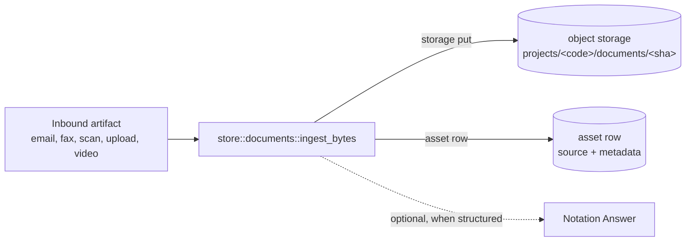

One inbound artifact landing on a [Project](project.md) — an email attachment, a scanned letter, an upload from a
client, a fax, a client-supplied video. Each Ingestion lands **exactly one new `asset` row** carrying the channel name
(`source`), the upstream artifact's revision id (`source_revision_id`), and the channel's `received_at` timestamp; the
1:1 mapping between an `asset` row and the upstream revision id is the matter's audit trail. There is no `documents`
table — the former `blobs` + `documents` split merged into `asset` (#449); see [Asset](asset.md).

Inbound channels share one entry point — `store::documents::ingest_bytes` — so the storage put + asset-row write happen
in one transaction. Per-channel data (email headers, fax metadata) belongs in per-channel tables (`inbound_emails`,
`inbound_faxes`) when those channels ship.

- Schema: [`asset` in `navigator.surql`](../../store/src/schema/navigator.surql) Queries:
  [`store::assets`](../../store/src/assets.rs) Lives in: the `asset` table in SurrealDB
