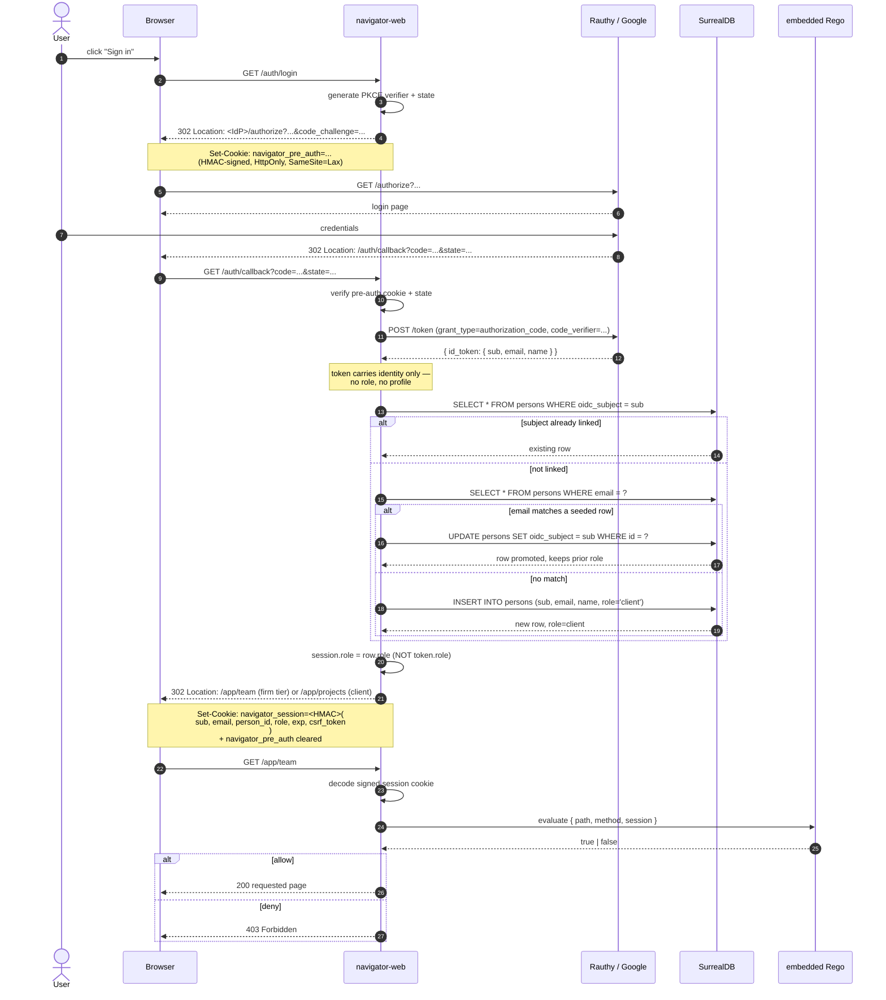
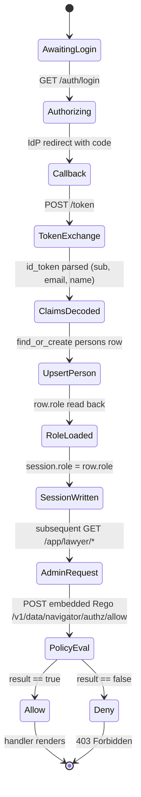

# OIDC + DB-role authorization

Neon Law Navigator separates **identity** (who you are) from **authorization** (what you can do). The OIDC providers
(Rauthy in local and staging dependency tiers, Google in production, and optionally Microsoft Entra ID alongside it —
see [A second provider](#a-second-provider-sign-in-with-microsoft)) own identity only — a stable `sub` and an address.
The `persons` table in our database owns everything else: profile, project memberships, billing relationships, and the
**single role** column (`owner` / `admin` / `lawyer` / `clerk` / `client`; anonymous is the absence of a row) that gates
the back-office. Embedded Rego evaluates the policy against that DB-sourced role, never against the IdP token. See
[`docs/access-model.md`](access-model.md) for the role/participation split.

This document is the canonical narrative for the system. The Rust modules link back to it from their rustdoc:

- [`portal::oauth`](../portal/src/oauth.rs) — `/auth/login`, `/auth/callback`, `/auth/logout`, and
  `upsert_person_from_claims`. [`portal::session`](../portal/src/session.rs) — signed cookie shape (`SessionData`).
  [`portal::policy`](../portal/src/policy.rs) — `PolicyClient` and `require_policy` middleware.
  [`store::persons`](../store/src/persons.rs) — the `person` row, including the `role` field. `role` is a single string,
  not a list, and its accepted values are the schema's own ASSERT — see
  [`navigator.surql`](../store/src/schema/navigator.surql).

## Login sequence

The full Authorization Code + PKCE flow, end to end, with the upsert step that links the IdP to a local `persons` row
and the embedded Rego decision that gates the requested route.



## Logout sequence

`GET|POST /auth/logout` clears the app's own session — that is the whole story for the Navigator session. But clearing
our cookie leaves the *provider's* SSO session live, so the very next `/auth/login` would silently re-authenticate with
no credential prompt. To close that gap, logout performs **RP-initiated OIDC logout** (OIDC RP-Initiated Logout 1.0):
after expiring the session and pre-auth cookies, it redirects the browser to the provider's `end_session_endpoint` from
the discovery document, carrying `post_logout_redirect_uri` (the app's own origin, derived from `OAUTH_REDIRECT_URI` so
it is the same origin the login flow already round-trips through and is therefore on the provider's allowlisted
`post_logout_redirect_uris`) and `client_id` (so the provider can validate the redirect without an `id_token_hint` — the
Navigator session never retains the id_token, so there is no hint to send). The provider clears its SSO session and
bounces back to the app.

When the provider publishes no `end_session_endpoint`, logout falls back to clearing the app session and redirecting to
the app home; it never hard-fails. Rauthy's `navigator-web` client fixture allowlists `http://localhost:*` for
`post_logout_redirect_uris`, matching the host `web` origin. See
[`portal::oauth::end_session_url`](../portal/src/oauth.rs).

## Identity vs authorization split

```mermaid
flowchart LR
    subgraph IdP[OIDC Provider]
        sub[sub<br/>provider-specific string]
        email[email<br/>lawyer@neonlaw.com]
        name[name<br/>Lawyer]
    end
    subgraph DB[persons row]
        oidc_subject[oidc_subject<br/>provider-specific string]
        local_email[email<br/>lawyer@neonlaw.com]
        local_name[name<br/>Lawyer]
        role["role<br/>lawyer"]
        profile[other profile<br/>columns...]
    end
    subgraph Session[signed session cookie]
        s_sub[sub]
        s_email[email]
        s_person_id[person_id]
        s_role[role &lt;-- from DB]
    end
    sub -->|id_token claim| oidc_subject
    email -->|id_token claim| local_email
    name -->|id_token claim| local_name
    oidc_subject --> s_sub
    local_email --> s_email
    role --> s_role
    profile -.->|never leaves the DB| profile
```

Two consequences fall out of this split:

1. **Granting/revoking access is one SQL statement**: `UPDATE persons SET role = 'lawyer' WHERE id = ?`. No IdP
   configuration change, no provider-side role or claim mapper.
2. **Replacing the IdP is an env-var swap**. The `sub` shape is provider-specific, but every column accepting `sub` is
   just `String`. See [`README.md → Swap to Google's OIDC`](../README.md). Production already runs this swap —
   `examples/deploy/k8s/gke/patches/web-env.yaml` sets `OAUTH_ISSUER_URL=https://accounts.google.com`. Rauthy is
   KIND-only and never reaches GKE.

### KIND-only: one public issuer

Rauthy publishes one canonical URL for discovery, token validation, and browser redirects. Each local tier derives it
from its Rauthy port: `http://localhost:<rauthy-port>/auth/v1/`. Chrome and host-run `web` reach that URL through KIND's
NodePort mapping. A full in-cluster `navigator-web` pod reaches the identical localhost URL through its
`rauthy-loopback-proxy` sidecar, which forwards to the `rauthy` Service while preserving the public Host header.

The CLI owns the alignment. `dev up` and `worktree-env up` patch Rauthy's `PUB_URL` and `RP_ORIGIN`; `dev deploy` also
patches the sidecar listen port and the in-cluster web issuer. Re-running either command with an unchanged port is a
no-op. This avoids advertising a browser-only authorization endpoint alongside pod-only token or JWKS endpoints, and
keeps `portal/src/oauth.rs` provider-agnostic. Production uses Google Identity Services and does not load this tier.

## How the role enters the session



Critically, the arrow into `SessionWritten` reads from the `persons` row, not from the id_token. A token-side role, if
present, is silently ignored — the `IdTokenClaims` struct in `portal::oauth` doesn't even include a `role` field.

## Local fixture, client, and environment

[`k8s/staging/rauthy.yaml`](../k8s/staging/rauthy.yaml) is the reusable deployment layer. It contains no bootstrap
credentials or client registration: an environment must supply `rauthy-secrets`, `rauthy-client`, and
`rauthy-bootstrap`, so a staging deployment without environment-owned values fails closed.

The KIND-only fixture at [`k8s/overlays/kind/rauthy/local-fixture.yaml`](../k8s/overlays/kind/rauthy/local-fixture.yaml)
supplies:

- **Client:** `navigator-web` — confidential Authorization Code flow, `S256` PKCE, RS256 id/access tokens, and loopback
  wildcard redirect, logout, and origin URLs for isolated worktree ports.
- **Role accounts:** `owner@neonlaw.com`, `admin@neonlaw.com`, `lawyer@neonlaw.com`, `clerk@neonlaw.com`, and
  `client@neonlaw.com`, each with password `password` and each carrying the matching app role. Four of the five are
  seeded onto all three demo matters; `admin@neonlaw.com` deliberately holds no participation on any of them, so the
  fixture Admin is an unassigned administrator and sees them in neither the list nor the detail view.
- **Rauthy administrator:** `nick@neonlaw.com` / `admin`, with the admin surface at
  `http://localhost:<rauthy-port>/auth/v1/admin`.

Rauthy has one full administrator rather than a realm-scoped `manage-users` administrator. The known password is
acceptable only in the loopback-bound KIND fixture; never promote that Secret into a shared environment.

`web` reads its OIDC wiring from the environment. The in-cluster KIND values, written to `.devx/env`, are:

```text
OAUTH_ISSUER_URL=http://localhost:30080/auth/v1/
OAUTH_CLIENT_ID=navigator-web
OAUTH_CLIENT_SECRET=<64-byte KIND fixture secret>
OAUTH_REDIRECT_URI=http://localhost:3001/auth/callback   # host-runs-web mode
SESSION_SECRET=<32+ bytes, HMAC>
```

Do not hand-roll worktree values. `.devx/env` uses that worktree's selected Rauthy and web ports. The full in-cluster
deployment uses the same issuer through the pod-local loopback bridge described above.

The Rust seam is three crates: `oauth2` drives the Authorization Code + PKCE state machine, `jsonwebtoken` verifies the
id_token signature against JWKS (RS256 in prod; HS256 accepted in tests only), and `reqwest` fetches the discovery doc
and JWKS with a bounded startup retry.

## A second provider: Sign in with Microsoft

Navigator holds one config **per provider**, not one config. The original slot — `OAUTH_ISSUER_URL` and its three
siblings — is the primary provider, unchanged: Google in production, Rauthy in the local lanes, any compliant OIDC
provider in principle. Setting `OAUTH_MICROSOFT_CLIENT_ID` adds Microsoft Entra ID **alongside** it. Leaving it unset
changes nothing: one button, one immediate redirect from `/auth/login`, one session cookie shape.

Adding rather than replacing is the whole point. A person's `persons.oidc_subject` is issued by whichever provider
authenticated them, and `resolve_person_from_claims` only ever links a subject to a row whose column is empty
([`portal::oauth`](../portal/src/oauth.rs)). Moving Google behind a broker would therefore change every existing subject
and leave every existing person resolving by email alone, permanently — including the highest-privilege rows. Adding a
provider next to Google leaves Google issuing exactly the subjects it always did.

### Why multi-tenant Entra needs code and not just config

Every other provider publishes a fixed `issuer` and the check is a byte compare, which is what `Validation::set_issuer`
does. Microsoft's multi-tenant authorities publish a **template**:

```console
$ curl -s https://login.microsoftonline.com/organizations/v2.0/.well-known/openid-configuration | jq .issuer
"https://login.microsoftonline.com/{tenantid}/v2.0"
```

The token then carries the signing directory's id in its own `tid` claim. Pinning the published string verbatim rejects
every real token, so `IdTokenVerifier` carries an `IssuerPolicy`:

- `Exact` — one fixed issuer, enforced inside `jsonwebtoken`. Google, Rauthy, and a **single-tenant** Entra
  registration (that authority publishes a concrete id, so it takes this path with no extra configuration).
- `EntraTenants` — `tid` must appear in the allowlist, and `iss` must then equal the template with `{tenantid}`
  replaced by that same `tid`. The allowlist is consulted first, so the string compared against `iss` can only ever be
  one an operator wrote into the environment.

Microsoft states the requirement itself: a multi-tenant application "must validate that the `issuer` property in the
published metadata matches the `iss` claim in the token, in addition to the usual check that the `iss` claim in the
token contains the tenant ID (`tid`) claim."

### The tenant allowlist is the domain gate, and it is mandatory

`GOOGLE_OAUTH_REQUIRED_HD` does **not** gate browser login — it is read only by
[`portal::google_oauth`](../portal/src/google_oauth.rs), the Bearer-token validator in front of `/mcp`. The browser gate
has always been the pre-seeded `persons` row: an authenticated identity with no row gets 403, whichever provider issued
it. That is a per-person gate rather than a per-domain one, and it is strictly better for signing in an external
client's people.

But it is a gate on the **address**, so the claim that carries the address has to be trustworthy, and for Entra one of
the two candidates is not:

| Claim | What it is | Trustworthy across tenants? |
| --- | --- | --- |
| `preferred_username` | normally the user principal name | **Yes** |
| `email` | copied from the directory's `mail` attribute | **No** |

Entra can only issue a UPN on a domain the signing tenant has verified with Microsoft, so a UPN is evidence about who
controls that domain. The `email` claim is copied out of the directory and nobody verifies it — Microsoft's own claims
reference says of it that "this value isn't guaranteed to be correct".

Anyone can create an Entra tenant for free. So on the Microsoft door Navigator matches on `preferred_username` first and
falls back to `email` only when the UPN is absent — and `OAUTH_MICROSOFT_ALLOWED_TENANTS` is **required**, with boot
failing rather than defaulting open. Together they mean a sign-in must come from a directory an operator named,
asserting a domain that directory proved it owns. Google is untouched: its `email_verified: true` is issued only after
Google has proved the user controls that mailbox, so there the address is evidence.

Onboarding a client organisation is therefore one more tenant id in that list, plus the `persons` rows and Project
participation that every client has always needed.

### One callback, two providers

Both providers share `OAUTH_REDIRECT_URI`, so there is exactly one public callback to register and defend. The provider
is carried in `PreAuth`, inside the existing HMAC-signed, `HttpOnly`, one-shot pre-auth cookie, next to `state` and the
PKCE verifier. The browser cannot forge it, and binding all three together means an authorization code can only be
redeemed at the token endpoint of the provider the login actually started against — the mitigation shape RFC 9207
describes for IdP mix-up. The field is `serde(default)`, so a login already in flight when a new build rolls out
completes against the primary provider instead of failing on an unrecognised cookie.

`/auth/login/{provider}` takes the slug (`oidc` for the primary slot, which is why the historical `/auth/login/oidc` URL
still resolves; `microsoft` for Entra). An unknown or unconfigured slug is a 404 — substituting the primary provider
would send somebody who clicked "Sign in with Microsoft" to a Google consent screen.

`/auth/login` renders the chooser when there is something to choose: a password door, or more than one provider. One
provider and no password door keeps the immediate redirect, byte-identical.

`SessionData.provider` records the slug so sign-out reaches the provider that actually holds the SSO session. Without it
a Microsoft-authenticated person was bounced through the primary provider's `end_session_endpoint` with a `client_id`
that provider does not own, and their Entra session survived. Sessions minted before the field existed decode with
`None` and fall back to the primary provider.

### Registering the Entra application — a checklist for a human

**This cannot be done from the repository.** It is an administrative action inside an Azure tenant, and someone with
tenant access has to do it once per deployment. The firm's directory already exists under its `*.onmicrosoft.com` name,
so steps 1 and 2 apply only when standing up a new one. `getuserrealm.srf` still reports `NameSpaceType: "Unknown"` for
`neonlaw.com` — that directory was never given the custom domain, and a registration does not need one.

1. **Create or identify a tenant.** A free Azure account creates a Default Directory with Entra ID Free attached, at no
   cost. Microsoft requires a non-prepaid card for identity verification and states it is not charged. Do **not** use
   the Microsoft 365 Developer Program: that sandbox is development-only and revocable if used otherwise.
2. **Check the domain first.** Visit
   `https://login.microsoftonline.com/getuserrealm.srf?login=admin@<domain>&json=1` for each domain the firm owns.
   `"NameSpaceType": "Unknown"` means no directory holds it. `Managed` or `Federated` means one does — possibly an
   unmanaged "viral" directory created by someone signing up for a free Microsoft service — and it must be taken over
   before that domain can be verified anywhere else. The app registration itself does not need a custom domain; an
   `*.onmicrosoft.com` tenant is sufficient.
3. **Register the application.** Entra admin center → **App registrations** → **New registration**.
   - **Supported account types:** *Accounts in any organizational directory* (`organizations`). Work or school accounts
     from any tenant, personal Microsoft accounts excluded — a client signing in with `@outlook.com` on Tuesday and
     `@theirfirm.com` on Thursday would otherwise become two unrelated identities. Choose *Accounts in this
     organizational directory only* instead if the app should admit only the firm's own directory, and set
     `OAUTH_MICROSOFT_ISSUER_URL` to that tenant's authority.
   - **Platform:** *Web*.
4. **Redirect URIs — register all of these, on the Web platform.** This is the single easiest step to get wrong.
   - `https://<host>/auth/callback` — the login callback, the value of `OAUTH_REDIRECT_URI`.
   - `https://<host>` **and** `https://<host>/` — the post-logout redirect. Microsoft requires the
     `post_logout_redirect_uri` to "match one of the redirect URIs registered for your application", and
     `portal::oauth::end_session_url` sends the app's own origin with **no** trailing slash. Microsoft separately
     documents that a redirect URI with no path segment "[is] returned with a trailing slash", so whether the path-less
     form is normalised on the way in is not something the documentation settles. Registering both spellings costs
     nothing and removes the question. If sign-out lands on a Microsoft error page, this is why.
   - For local development, `http://localhost:3001/auth/callback` and `http://localhost:3001`. Entra permits plain
     HTTP only for `localhost`, and for localhost it ignores the port when matching — so do not register two localhost
     URIs that differ only by port, and differentiate development URIs by path instead.
   - Redirect URIs are **case-sensitive** and must match the case the application actually serves.
5. **Do not enable implicit ID tokens.** The "ID tokens (used for implicit and hybrid flows)" checkbox governs
   issuance from `/authorize`. Navigator uses `response_type=code` with PKCE and reads the `id_token` out of the token
   response, which needs no such flag. (Older guidance says this checkbox is mandatory; that applies to
   `response_type=id_token`, which Navigator never sends.)
6. **Permissions.** `openid`, `profile`, `email` only — the delegated Microsoft Graph defaults. Nothing more. Staying
   inside "basic sign-in and read user profile" is what keeps the app outside the policy that blocks consent to
   unverified multi-tenant applications, so **publisher verification is not a launch gate**. It removes the "Unverified"
   wording from the consent prompt and can follow later. Expect the portal to contradict this: every new multitenant
   registration carries a banner saying end users cannot consent without a verified publisher, and it does not
   distinguish an app confined to this permission set. Nothing here settles which wins, so treat the first external
   organisation's consent as the test.
7. **Credential.** Create a client secret and record its expiry — Entra caps secret lifetime at 24 months and recommends
   under 12. Microsoft's own advice is that secrets "should not be used in production environments" and that
   certificates are the recommended credential type; Navigator posts `client_secret_post` today, so a secret with a
   calendar reminder is the current shape.
8. **Record the values.** Application (client) ID → `OAUTH_MICROSOFT_CLIENT_ID`. The secret →
   `OAUTH_MICROSOFT_CLIENT_SECRET`, in the deployment's Kubernetes Secret alongside `OAUTH_CLIENT_SECRET`; client IDs
   are public identifiers and appear in browser-visible authorize URLs, secrets never are. Directory (tenant) ID of
   **every** organisation whose people should be able to sign in → `OAUTH_MICROSOFT_ALLOWED_TENANTS`.
9. **Warn the client's IT, once.** A tenant administrator can disable end-user consent, in which case an admin has to
   approve the application before anyone in that organisation can sign in — common in security-conscious firms, and
   invisible from outside until the first person tries. Sending an admin through the flow with `prompt=consent` resolves
   it in one click. Budget for this being on somebody else's calendar.

## Authorization is decided elsewhere

OIDC supplies *identity* — who the caller is, stamped into the session at callback time. It does not decide
*authorization*. Navigator compiles and evaluates its Rego policy in process from `portal/policy/navigator.rego`. For
decision semantics (admin bypass, lawyer-tier writes, project-scoped reads), see
[`docs/access-model.md`](access-model.md#how-embedded-rego-decides); for runtime and Rego authoring, see
[`docs/rego-policy.md`](rego-policy.md). The one identity fact that matters here: `input.session.role` is whatever
`persons.role` was at callback time, so a user demoted to `client` in the database is denied at their next login — no
IdP coordination required.

## Admin client impersonation

Navigator's admin impersonation is modeled after OAuth 2.0 Token Exchange's actor/subject split, not after IdP-side role
mapping. During impersonation, the browser's signed `SessionData` changes its effective top-level identity to the target
client person (`sub`, `email`, `person_id`, `role = client`) and carries an `impersonation` actor block with the admin
who initiated it. That mirrors the RFC 8693 shape where the token's top-level subject is the represented user and the
`act` claim identifies the current actor.

The practical rules are:

1. Only an `admin` session may start impersonation.
2. The target must be a `client` person. Owner and Admin cannot impersonate Clerk, Lawyer, Admin, or Owner.
3. Embedded Rego and route-layer project visibility evaluate the effective client session, so portal reads use the same
   client ACLs as a real client login.
4. Every shared-layout page renders a persistent impersonation banner with the target name/email and a POST-only exit
   control.
5. Exiting impersonation reloads the admin actor's `persons` row before restoring the session, so a demotion during an
   impersonation window is honored immediately.

This is still application-session impersonation, not a Rauthy-specific feature. Rauthy remains a KIND-only identity
provider and production may use Google OIDC; both only need to provide the login identity. The DB-owned `persons.role`
and signed Navigator session own the impersonation state.

## Verified end-to-end

`server/tests/oidc_e2e.rs` exercises the entire pipeline against a mocked OIDC provider and the compiled production
policy. Ten tests:

1. `full_oidc_flow_upserts_person_and_allows_lawyer` — happy path; person row created with email + name from the
   id_token.
2. `embedded_policy_denies_client_admin_route_with_403` — the compiled policy denies a Client-tier caller with 403.
3. `second_login_with_same_subject_does_not_create_duplicate_person` — re-running the login doesn't insert a second row.
4. `a_client_reaches_the_matter_surface_the_admin_routes_deny_them` — a Client-tier login reaches `/app/projects` with
   200; scoping happens in the handler, not at the route gate.
5. `user_with_db_lawyer_role_can_hit_every_admin_route` — pre-seeds `role = lawyer` in the DB, logs in (promoting the
   row), hits six app routes (`/app/lawyer`, `/app/admin/entities`, `/app/admin/jurisdictions`,
   `/app/admin/entity-types`, `/app/admin/templates`, `/app/admin/questions`) using the production policy. The people
   index is absent because it answers at `/app/admin/people`, Owner/Admin only.
6. `user_with_client_role_is_denied_from_admin_routes` — a pre-seeded Client-tier login still reads `role = client`
   after callback, and every admin route returns 403.
7. `db_role_revocation_takes_effect_on_next_login` — a lawyer user starts with lawyer, succeeds; row is updated to `role
   = 'client'`; next login produces a session that fails the embedded Rego check.
8. `callback_returns_403_html_when_email_is_not_pre_seeded` — an id_token for an email with no `persons` row renders
   the styled sign-in-specific 403 page and creates no row; sign-up is operator-mediated.
9. `callback_jit_creates_bootstrap_owner_with_owner_role_when_absent` — the configured bootstrap-Owner email JIT-creates
   its `persons` row with `role = owner` on first login to a fresh deployment.
10. `bootstrap_owner_role_heals_back_after_being_cleared` — the bootstrap-Owner row is pre-seeded as `client`, and the
    next sign-in restores `role = owner`.

Run them with:

```bash
cargo test -p server --test oidc_e2e
```

## Troubleshooting

- **`/auth/callback` returns 400 "invalid state".** Pre-auth cookie path / SameSite mismatch — the cookie set at
  `/auth/login` must be readable at `/auth/callback`. Over plain HTTP in dev that means `SameSite=Lax` + `Secure=false`.
- **JWKS fetch fails with a TLS error.** `OAUTH_ISSUER_URL` is `https` but in-cluster Rauthy is plain HTTP — set it to
  `http://…`; the spec permits it.
- **Token exchange returns `invalid_client`.** `OAUTH_CLIENT_SECRET` does not match the bootstrapped `navigator-web`
  client. Reconcile the environment-owned `rauthy-client` Secret and client registration.
- **id_token verifies but a role claim is empty.** Expected — the session role never comes from the token; it is read
  from the `persons` row at callback time (see above). Don't add a Rauthy role mapper to work around it.

## Canonical sources

- OIDC Core 1.0: <https://openid.net/specs/openid-connect-core-1_0.html>
- OIDC Discovery 1.0: <https://openid.net/specs/openid-connect-discovery-1_0.html>
- OIDC RP-Initiated Logout 1.0: <https://openid.net/specs/openid-connect-rpinitiated-1_0.html>
- OAuth 2.0 PKCE (RFC 7636): <https://datatracker.ietf.org/doc/html/rfc7636>
- Rauthy: <https://sebadob.github.io/rauthy/>
- Google Identity (OIDC): <https://developers.google.com/identity/openid-connect/openid-connect>
- OAuth 2.0 Authorization Server Issuer Identification (RFC 9207): <https://datatracker.ietf.org/doc/html/rfc9207>
- Microsoft identity platform, OIDC: <https://learn.microsoft.com/en-us/entra/identity-platform/v2-protocols-oidc>
- Entra ID token claims: <https://learn.microsoft.com/en-us/entra/identity-platform/id-token-claims-reference>
- Multi-tenant apps: <https://learn.microsoft.com/en-us/entra/identity-platform/howto-convert-app-to-be-multi-tenant>
- Publisher verification: <https://learn.microsoft.com/en-us/entra/identity-platform/publisher-verification-overview>
- Redirect URI restrictions: <https://learn.microsoft.com/en-us/entra/identity-platform/reply-url>
- `oauth2` crate: <https://docs.rs/oauth2> · `jsonwebtoken` crate: <https://docs.rs/jsonwebtoken>
