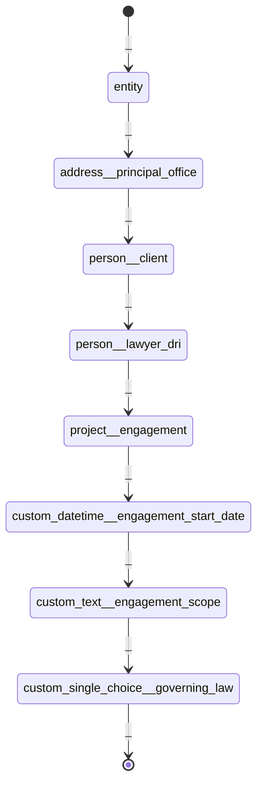
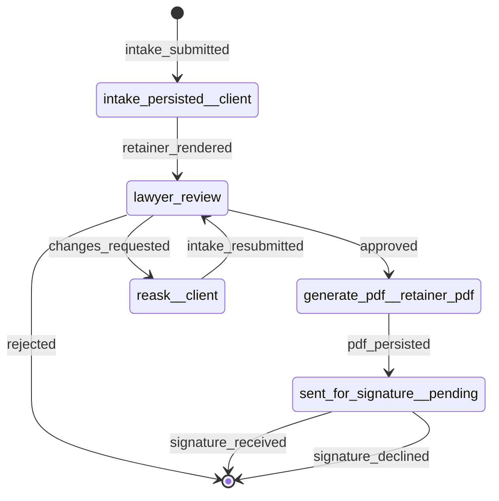
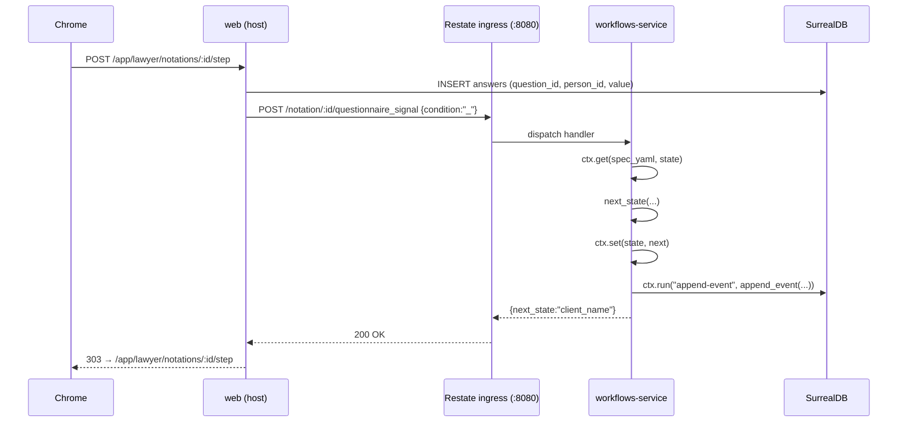

# Retainer intake walkthrough

The retainer-intake flow is a pair of durable state machines per [Notation](notation.md#notation), declared in the
frontmatter of [`templates/neon_law/shared/onboarding_letter.md`](../templates/neon_law/shared/onboarding_letter.md) and
walked by the [`portal::retainer_walk`](../portal/src/retainer_walk.rs) module:

1. **Questionnaire walker** — one question per request, one [Answer](notation.md#answer) per advance, one
   [Notation Event](glossary.md#notation-event) per transition. Walks the state chain `BEGIN` → `entity` →
   `address__principal_office` → `person__client` → `person__lawyer_dri` → `project__engagement` →
   `custom_datetime__engagement_start_date` → `custom_text__engagement_scope` → `custom_single_choice__governing_law` →
   `END` — eight questions in all. The matter's scope renders from the clause spliced at `{{custom_clauses}}`, written
   per client; fees are set in a separate signed fee writing rather than asked here.
2. **Post-intake workflow** — fires once the questionnaire reaches `END`. Walks `intake_persisted__client` →
   `lawyer_review` → `generate_pdf__retainer_pdf` → `sent_for_signature__pending` → `END`, driving render, PDF
   persistence, and "sent for signature".

Both timelines share the same runtime surface ([`workflows::StateMachineRuntime`](../workflows/src/runtime.rs)), keyed
by `(MachineKind, notation_id)`, and run as a single [Restate](glossary.md#restate) virtual object per Notation. The
worker that hosts the object lives in [`workflows-service/`](../workflows-service/).

## Questionnaire state machine



The bare `_` condition is the only signal that advances a questionnaire (the canonical "respondent answered"). State
names use the typed `<type>__<role>` grammar, so the retainer asks for an Entity, an Address, a Person, and a Project
instead of duplicating their fields as custom text. `entity` carries no role suffix because the questionnaire asks for
only one entity — the Client itself.

## Post-intake workflow



State names use the `<prefix>__<discriminator>` form so [`workflows::step_kind_for`](../workflows/src/step.rs) can pick
the right actor class (system / lawyer / respondent) per state.

## HTTP surface

Four routes, all under [`portal::retainer_walk`](../portal/src/retainer_walk.rs):

- `GET /app/lawyer/retainers/new` — render the "start a walk" form.
- `POST /app/lawyer/retainers/new` — find-or-insert person, then insert project + role + notation in one
  transaction; redirect to `/app/lawyer/notations/:id/step`.
- `GET /app/lawyer/notations/:id/step` — render the current question, or redirect once the questionnaire reaches
  `END`.
- `POST /app/lawyer/notations/:id/step` — persist the answer, signal the runtime, advance the walker — or, on
  `END`, drive the post-intake workflow (render → send for signature).

Every state-changing request carries a CSRF token; auth is enforced by the `require_auth` layer on the admin router.

## One POST through the stack

What a single `POST /app/lawyer/notations/:id/step` looks like when `RESTATE_BROKER_URL` is set (the in-cluster
`restate` Service in KIND, or the GKE-managed broker in production):



The two `db` arrows have two different writers: the walker writes [Answers](notation.md#answer) directly; the worker is
the sole writer of [Notation Events](glossary.md#notation-event), inside [`ctx.run`](glossary.md#ctxrun) so a crash +
replay reuses the cached row id instead of double-inserting.

## Persistence

**[Restate](glossary.md#restate) is the source of truth for state; the `notation_event` table is the durable projection
of that state.** A signal lands in Restate's keyed state first; the SurrealDB row is the worker's `ctx.run` side effect,
journaled so a replay never double-writes.

Each transition is recorded as one row in `notation_event`
([`store::notation_events`](../store/src/notation_events.rs)), the append-only journal that mirrors
[`workflows::WorkflowEvent`](../workflows/src/runtime.rs). The "current state" of a `(notation_id, machine_kind)`
machine is the `to_state` of the latest row — see [`latest_for_kind`](../store/src/notation_events.rs). For a
questionnaire signal, the `payload` column carries `{"answer_value": "…"}`; for a workflow signal it is `None`.

Answers themselves are stored in the `answers` table, keyed by `(question_id, person_id)`. The walker pre-fills the
prior answer when the user navigates back so re-display is read-only.

## Durable execution

Restate is the production target. The [`workflows-service`](../workflows-service/) crate registers a `Notation` virtual
object with the broker; each `questionnaire_signal` and `workflow_signal` handler reads the spec yaml + current state
from Restate's keyed state, computes the next state, persists it back, and appends one row to `notation_events` inside
`ctx.run("append-event", …)` so a replay reuses the cached row id instead of double-writing.

The application-side adapter ([`workflows::runtime_restate::RestateRuntime`](../workflows/src/runtime_restate.rs)) posts
to the broker's ingress port. When `RESTATE_BROKER_URL` is unset, `web` falls back to the in-process
[`InMemoryRuntime`](../workflows/src/runtime.rs) used in tests and local dev.

## The signature seam

[`portal::signature::SignatureProvider`](../portal/src/signature.rs) is an async trait with three methods:

```rust
#[async_trait]
pub trait SignatureProvider: Send + Sync {
    async fn send_for_signature(
        &self,
        notation_id: Uuid,
        pdf: &[u8],
        manifest: &SignatureManifest,
    ) -> Result<SignatureRequestId, SignatureError>;

    async fn create_recipient_view(
        &self,
        request_id: &SignatureRequestId,
        view: &RecipientView,
    ) -> Result<String, SignatureError>;

    async fn fetch_completed_documents(
        &self,
        request_id: &SignatureRequestId,
    ) -> Result<CompletedDocuments, SignatureError>;
}
```

`StubSignatureProvider` records every call to an internal `Mutex<Vec<…>>`; tests assert on it, and it is what dev runs
against when `DOCUSIGN_*` env vars are unset. `DocuSignSignatureProvider`
([`portal/src/signature.rs`](../portal/src/signature.rs)) is already a live, shipped implementation of the same trait —
[`portal::hosting`](../portal/src/hosting.rs) selects it automatically whenever the `DOCUSIGN_*` env vars are
configured, and falls back to the stub only when they are unset. Both use the same `Arc<dyn SignatureProvider>` in
[`portal::AppState`](../portal/src/lib.rs), consistent with
[`docs/provider-environment-parity.md`](provider-environment-parity.md)'s description of DocuSign as live per-deployment
infrastructure rather than a future swap-in.

## Test coverage

- **Spec shape**: [`workflows/tests/retainer_intake_spec.rs`](../workflows/tests/retainer_intake_spec.rs) parses the
  YAML and drives the spec end-to-end on `InMemoryRuntime`.
- **Walker progress**: unit tests in [`portal/src/retainer_walk.rs`](../portal/src/retainer_walk.rs) cover
  `progress_for` across BEGIN, mid-walk, and the last-question cap.
- **View components**: SSR tests beside each Dioxus page cover the four lawyer renders:
  [`webapp/src/retainer_start.rs`](../webapp/src/retainer_start.rs) the template picker and its refusal flash,
  [`webapp/src/walker_step.rs`](../webapp/src/walker_step.rs) the per-answer-type step (text / country / people-list
  branches, prior-answer pre-fill), [`webapp/src/intake_review.rs`](../webapp/src/intake_review.rs) the review phases
  and the CSRF token on every write, and [`webapp/src/reask.rs`](../webapp/src/reask.rs) the flagged re-ask.
- **Restate adapter**: [`workflows/src/runtime_restate.rs`](../workflows/src/runtime_restate.rs) uses `wiremock` to pin
  the broker wire shape per `MachineKind`.
- **Worker handlers**: `workflows-service/src/notation_service.rs` pins `next_state` against the questionnaire spec; the
  journal helpers live next door in `workflows-service/src/journal.rs`.
- **HTTP + browser**: `server/tests/browser_e2e.rs` drives the full retainer walk end-to-end via fantoccini +
  chromedriver.
